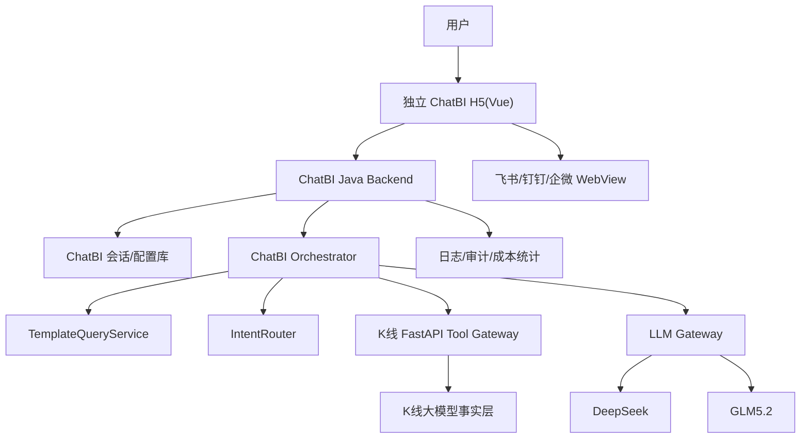
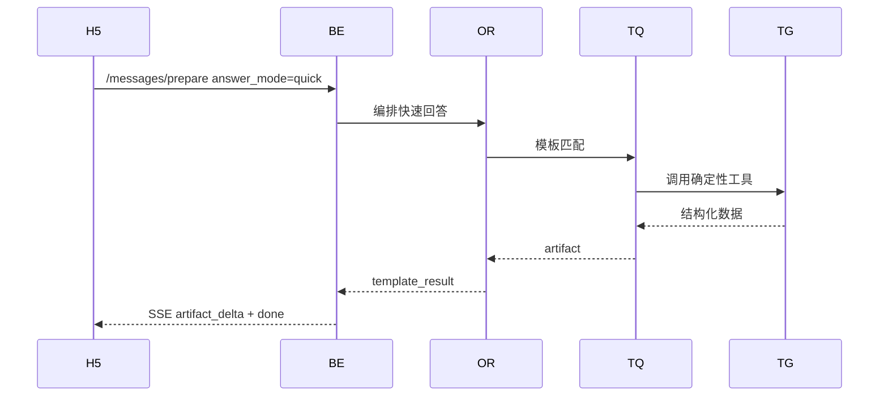
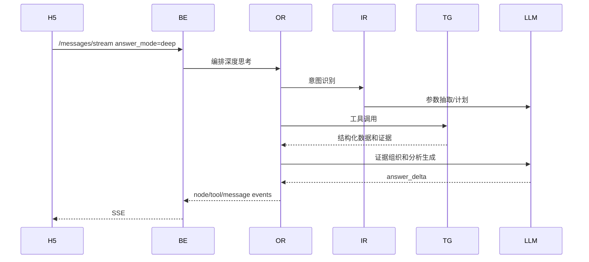
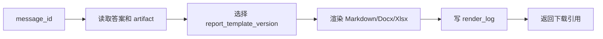

# ChatBI 系统架构设计

- **日期**: 2026-07-03
- **阶段**: Design Gate E
- **目标**: 明确移动端 ChatBI 的系统边界、请求链路、SSE 链路、工具调用链路、模型调用链路和企业平台链路

## 1. 总体架构



## 2. 部署单元

| 单元 | 职责 |
|---|---|
| `chatbi-web` | 独立移动端 H5，不进入现有 PC React 工作台 |
| `chatbi-server` | Java/Spring Boot/RuoYi 后端，会话、流式、配置、审计 |
| `kline-tool-gateway` | K线大模型 FastAPI 工具服务 |
| `llm-gateway` | 统一模型调用、fallback、token 成本统计 |
| `chatbi-db` | 会话、配置、日志、审计 |

## 3. 请求链路

### 3.1 快速回答链路



特点：

```text
不调用大模型生成分析正文。
不展示思考过程。
优先稳定、快、可复核。
```

### 3.2 深度思考链路



特点：

```text
展示思考节点。
必须引用数据日期和证据来源。
可以输出口径说明、风险提示和预期差。
```

## 4. SSE 链路

SSE 由 Java 后端直接对 H5 输出，K线工具服务和 LLM Gateway 不直接暴露给前端。

```text
H5 -> chatbi-server -> ChatBIStreamService -> ChatBIOrchestrator
```

断线策略：

| 场景 | 处理 |
|---|---|
| 前端断开 | 后端标记 `client_disconnected`，可继续或取消 |
| 工具超时 | 输出 `error`，保留已完成节点 |
| 模型失败 | 按 fallback 模型重试一次 |
| 用户停止 | 写入 `stopped`，停止后续模型输出 |

## 5. 工具调用链路

```text
ChatBIOrchestrator
-> ToolRegistry 权限检查
-> ToolGatewayClient
-> K线 FastAPI Tool Gateway
-> K线事实层
```

约束：

```text
只允许工具白名单。
不允许用户 SQL。
不允许 Java 后端直接访问 K线核心事实表。
所有工具返回必须带 data_date、source、empty_reason。
```

## 6. 模型调用链路

```text
ChatBIOrchestrator
-> LLMGatewayService
-> provider adapter
-> DeepSeek / GLM5.2 / OpenAI-compatible
```

节点级模型配置：

| 节点 | 可配置模型 |
|---|---|
| `intent_recognition` | DeepSeek / GLM5.2 |
| `query_planning` | DeepSeek / GLM5.2 |
| `evidence_extraction` | GLM5.2 / DeepSeek |
| `answer_generation` | DeepSeek / GLM5.2 |
| `report_generation` | GLM5.2 / DeepSeek |

## 7. 报告生成链路



报告生成只使用已落库的消息、artifact 和工具引用，不重新隐式调用不可追踪数据源。

## 8. 平台免登链路

```text
企业平台 WebView
-> 平台授权 code
-> PlatformIdentityService
-> chatbi_platform_bindings
-> internal_user_id + permissions
```

第一版可先接一个平台试点。H5 独立访问时使用现有开发登录或平台统一登录。

## 9. PC 端边界

第一版不进入现有 PC 工作台。

允许：

```text
独立 H5 URL
企业应用 WebView URL
后续经确认后新增 PC 外链入口
```

禁止：

```text
修改 PC 页面
修改 PC 路由
修改 PC 左侧导航
修改 PC 业务组件
修改 PC 既有接口契约
```

