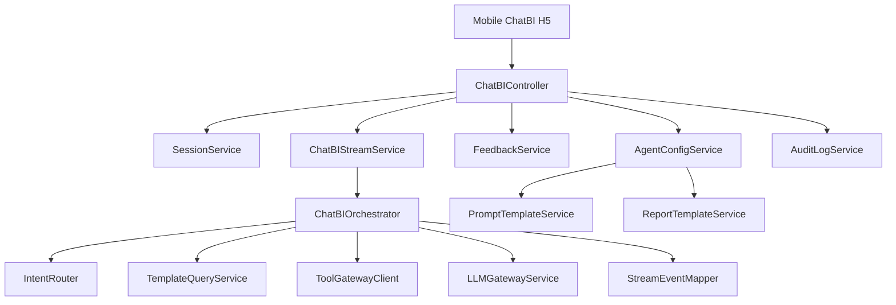
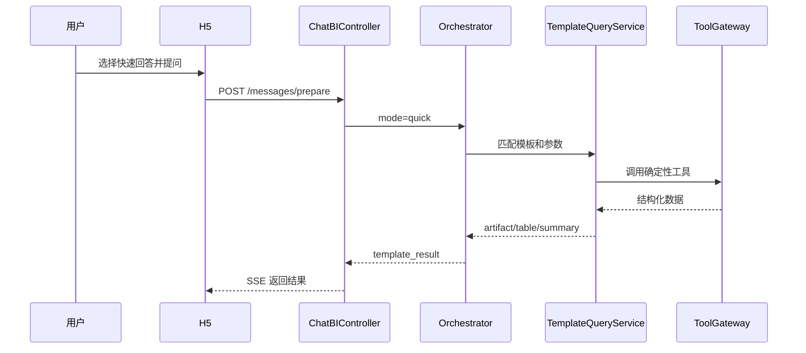
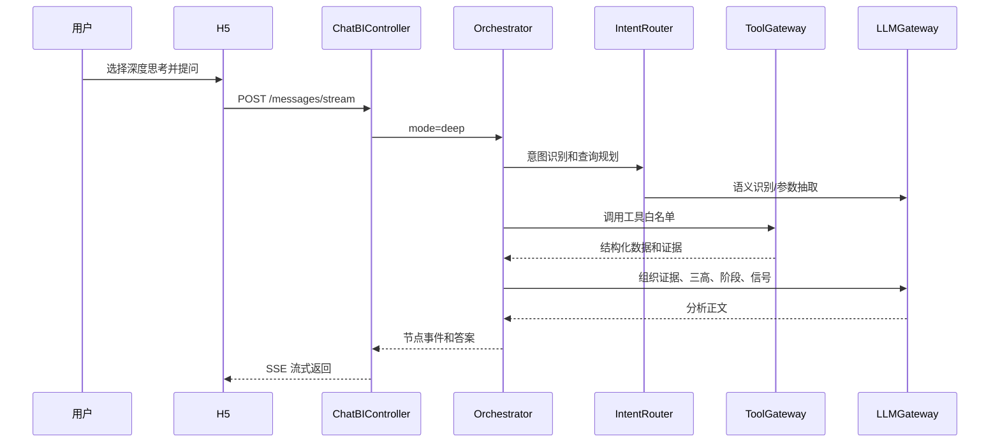

# ChatBI 后端设计

- **日期**: 2026-07-03
- **阶段**: Design Gate D
- **范围**: 后端模块边界、服务职责、编排流程
- **约束**: 不接 Dify；不直接执行用户 SQL；不直接读写 K线大模型核心事实表；不修改现有 PC 端页面和接口契约

## 1. 设计目标

后端要支撑移动端 ChatBI 的两条问答链路：

| 模式 | 后端路径 | 说明 |
|---|---|---|
| 快速回答 | Template Query Path | 直接命中模板化查询，调用确定性工具，返回结构化结果，不展开大模型分析 |
| 深度思考 | LLM Orchestrated Path | 通过大模型做意图识别、证据组织、口径说明和分析总结，返回思考过程 |

第一版后端复用原 Java/RuoYi 的会话、历史、反馈、智能体配置和流式输出基础，替换 Dify 调用链为 `ChatBIOrchestrator`。

## 2. 模块边界



## 3. 服务职责

| 模块 | 职责 | 复用来源 |
|---|---|---|
| `ChatBIController` | 暴露会话、消息、流式问答、反馈、配置接口 | 适配复用 `GacDifyAIController`、`AiHistoryController` |
| `SessionService` | 创建会话、保存消息、查询历史 | 适配复用 `AiHistoryEntity`、`AiHistoryMapper.xml` |
| `ChatBIStreamService` | SSE 输出、停止生成、事件落库 | 扩展复用 Dify 流式事件结构 |
| `ChatBIOrchestrator` | 统一编排快速回答和深度思考 | 新增 |
| `IntentRouter` | 意图识别、工具选择、参数抽取 | 新增，深度模式可调用 LLM |
| `TemplateQueryService` | 快速回答模板匹配和参数校验 | 新增 |
| `ToolGatewayClient` | 调用 K线 FastAPI 工具服务 | 新增 |
| `LLMGatewayService` | 调用 DeepSeek、GLM5.2 等模型 | 新增 |
| `AgentConfigService` | 智能体、工具范围、节点模型配置 | 适配复用 `AiAgentTypeDifyController` |
| `PromptTemplateService` | 提示词版本读取和发布状态校验 | 新增 |
| `ReportTemplateService` | 报告模板版本读取和导出参数校验 | 新增 |
| `FeedbackService` | 赞/踩、意见反馈 | 适配复用 `AiFeedbackRequestVO` |
| `AuditLogService` | 审计日志、工具调用日志、模型调用日志 | 新增 |

## 4. 核心流程

### 4.1 快速回答



快速回答只允许返回：

```text
模板命中说明
结构化表格
数据日期
来源摘要
空状态或缺参提示
```

不返回：

```text
大模型推理过程
投资建议
无法追溯的结论
```

### 4.2 深度思考



深度思考必须返回：

```text
思考节点
工具调用结果
证据来源
数据日期
口径说明
分析结论
风险提示
```

## 5. SSE 事件

| event | 模式 | 说明 |
|---|---|---|
| `message_prepared` | quick/deep | 消息已创建 |
| `template_matched` | quick | 命中模板 |
| `node_started` | deep | 节点开始 |
| `node_finished` | deep | 节点结束 |
| `tool_started` | quick/deep | 工具调用开始 |
| `tool_finished` | quick/deep | 工具调用结束 |
| `artifact_delta` | quick/deep | 表格、证据卡、报告块 |
| `message_delta` | deep | 大模型正文增量 |
| `done` | quick/deep | 完成 |
| `error` | quick/deep | 错误 |

## 6. 权限边界

| 权限 | 允许能力 |
|---|---|
| `chatbi.basic` | 会话、历史、反馈、普通问答 |
| `chatbi.supply_chain` | 产业链候选、公司证据链 |
| `chatbi.stock_model` | 选股模型结果和诊断 |
| `chatbi.bond_model` | 选债模型结果和诊断 |
| `chatbi.report_export` | 报告导出 |
| `chatbi.admin` | 智能体、提示词、模板配置 |
| `chatbi.model_config` | 模型供应商和节点级模型配置 |

所有工具调用前必须校验：

```text
用户权限
agent 工具白名单
参数合法性
返回行数上限
是否允许导出
```

## 7. 错误策略

| 错误码 | 场景 | 前端表现 |
|---|---|---|
| `CHATBI_TEMPLATE_NOT_FOUND` | 快速回答未命中模板 | 提示切换深度思考 |
| `CHATBI_PARAM_MISSING` | 缺少公司、模型、日期等参数 | 追问补充参数 |
| `CHATBI_TOOL_TIMEOUT` | 工具超时 | 显示重试 |
| `CHATBI_TOOL_EMPTY` | 工具返回空 | 展示空状态和数据缺口 |
| `CHATBI_LLM_UNAVAILABLE` | 模型不可用 | fallback 或提示稍后重试 |
| `CHATBI_PERMISSION_DENIED` | 权限不足 | 提示联系管理员 |
| `CHATBI_QUERY_BLOCKED` | 试图执行 SQL 或越权查询 | 拒绝并记录审计 |

## 8. 观测字段

每次消息必须记录：

```text
session_id
message_id
answer_mode
agent_id
user_id
platform
intent
tool_ids
prompt_version_id
model_id
template_id
template_version_id
data_date
elapsed_ms
token_input
token_output
cost_estimate
status
error_code
```

## 9. 实施边界

本设计只允许后续在独立 ChatBI 工程中实施：

```text
chatbi-workspace/frontend-vue
chatbi-workspace/backend-java
```

不得修改：

```text
现有 PC 端页面
现有 PC 端路由
现有 PC 端左侧导航
现有 PC 端业务组件
现有 PC 端既有接口契约
```

