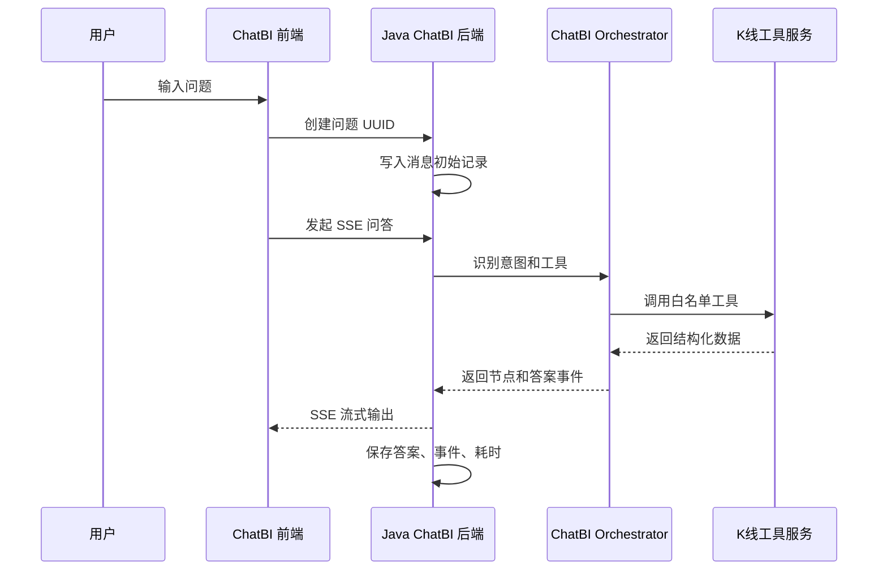
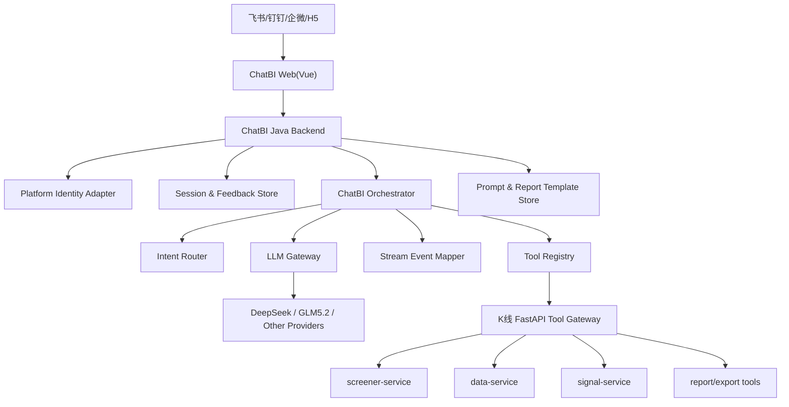
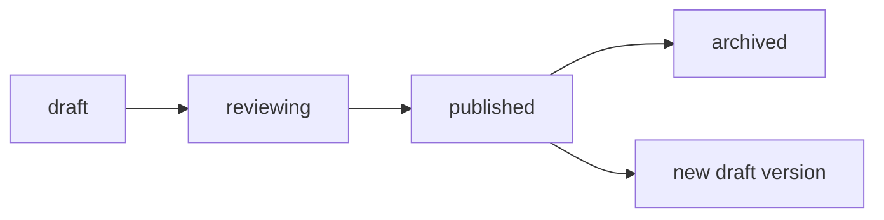
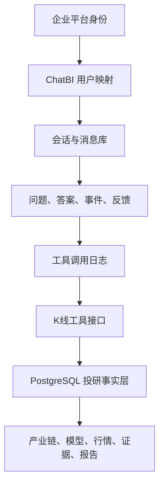

# 独立 ChatBI 应用复用改造详细设计

- **Date**: 2026-07-03
- **Status**: Draft
- **Based on PRD**: `docs/prd/chatbi-standalone-reuse-2026-07-03.md`
- **Scope**: 复用原 Vue 前端与 Java/Spring Boot 后端，不接 Dify，接入 K线大模型投研工具；第一版做独立移动端 ChatBI H5 应用，优先挂载飞书、钉钉、企业微信；纳入模型供应商配置、节点级模型配置、提示词管理和报告模板管理。

## 1. 设计结论

本项目可复用原 ChatBI 的交互壳和会话后端，但不能原样复用 Dify 调用链。推荐方案是保留原前端的流式聊天体验和 Java 后端的会话、反馈、热门问题能力，把原 `GacAIDifySteamServiceImpl` 中的 Dify 转发逻辑替换为本项目自研的 `ChatBI Orchestrator`。

第一版采用双系统边界：

```text
原 ChatBI Java 后端：负责用户、会话、流式协议、反馈、平台免登、智能体配置。
K线大模型 FastAPI 服务：负责产业链、选股、选债、行情、证据链、报告生成等投研工具。
```

Java 后端不直接查 K线 PostgreSQL 业务表，避免重复实现数据权限、模型逻辑和证据口径。所有投研查询通过白名单工具接口调用。

模型调用统一走 `LLM Gateway`。管理员可以配置 DeepSeek、GLM5.2 等供应商和模型版本，并按智能体的执行节点绑定默认模型、fallback 模型、提示词版本和报告模板版本。比如语义识别可以用低成本快速模型，报告生成可以用长文本能力更强的模型。业务代码不直接写死模型 key、base_url 或 prompt 内容。

工程实施前必须先完成全套设计。第一步完成移动端前端原型设计和预览设计，用于确认独立 H5 应用的页面结构、交互路径、信息密度、证据卡片、节点过程、模型配置、提示词和报告模板管理如何展示；第二步完成后端设计、接口契约、工具契约、数据模型、系统架构、安全和可观测性设计。全部设计验收通过后，才进入后端、前端和数据库实施。

## 2. 复用资产评估

### 2.1 前端包

路径：

```text
/Users/rogerluo/程序目录/K线大模型/chatBI/ai 前端.zip
```

可复用：

| 模块 | 复用方式 |
|---|---|
| `ai/index.vue` | 代码优先原样复用，保留首页、热门关键词、热门问题入口 |
| `module1.vue` | 代码优先适配复用，保留聊天输入、流式输出、思考节点、停止生成 |
| `Markdown.vue` | 代码优先适配复用，保留 Markdown 渲染，新增 artifact renderer |
| `componentsHistory.vue` | 代码优先原样或轻量适配复用，保留历史会话入口 |
| `feedback.vue` | 代码优先原样或轻量适配复用，保留赞/踩和意见反馈 |
| `feedView.vue` | 代码优先适配复用，作为反馈结果和意见展示基础 |

需要改造：

| 问题 | 改造方向 |
|---|---|
| API 路径含 `/gac/dify/ai` | 增加兼容路由，后续统一为 `/api/v1/chatbi` |
| 事件字段使用 `type/node/times/message/isShow` | 后端继续输出兼容字段，新增标准字段 `event_id/artifact_type/payload` |
| 只有 Markdown 文本渲染 | 增加 table/chart/evidence/card artifact 渲染 |
| Vue 依赖 Element/Vant | 第一版保留，未来 React 重构 |

### 2.2 后端包

路径：

```text
/Users/rogerluo/程序目录/K线大模型/chatBI/AI 后端.zip
```

可复用：

| 模块 | 复用方式 |
|---|---|
| `GacDifyAIController` | 适配复用，保留兼容路由和 SSE 出口，内部从 Dify 转发改为 ChatBI Orchestrator |
| `AiHistoryController` | 原样或轻量适配复用，保留历史会话查询 |
| `AiAgentTypeDifyController` | 适配复用，改造成 ChatBI 智能体和节点级模型配置入口 |
| `AiHistoryMapper.xml` | 适配复用，保留会话消息存储思路，必要时扩展字段 |
| `GacDifyData` | 原样或轻量适配复用，保留前端兼容事件结构 |
| `GacRAGFlowAIRequestVO` | 适配复用，扩展为 ChatBI 请求对象 |
| `AiHistoryEntity` | 适配复用，保留会话、问题、答案和节点记录基础字段 |
| `AiFeedbackRequestVO` | 原样或轻量适配复用，保留用户反馈请求结构 |
| RuoYi `BaseController` / `AjaxResult` / 权限注解 | 原样复用，保持后台管理和权限风格 |

必须清理：

| 内容 | 处理 |
|---|---|
| `.git` | 不进入新工程 |
| `target/`、jar、class | 不进入新工程 |
| `.idea` | 不进入新工程 |
| 数据库账号、密码、内部 URL | 删除并轮换 |
| Dify key、Dify path | 删除或迁移为安全配置 |

### 2.3 代码复用分级

工程实施前必须先形成代码复用清单：

```text
docs/reviews/chatbi-code-reuse-inventory-2026-07-03.md
```

复用分级如下：

| 分级 | 含义 | 处理原则 |
|---|---|---|
| 原样复用 | 不改业务逻辑，只调整路径或构建配置 | 优先保留，减少风险 |
| 适配复用 | 保留主体代码，替换接口路径、字段映射或样式壳 | 第一版主要方式 |
| 扩展复用 | 保留原组件/类，新增 artifact、节点模型、报告模板等能力 | 用新增文件或小范围修改实现 |
| 替换 | 原逻辑依赖 Dify、明文密钥或不符合安全边界 | 必须说明替换原因 |
| 废弃 | `.git`、`target`、IDE 文件、无用构建产物或敏感配置 | 不进入新工程 |

前端代码复用原则：

```text
优先保留原 Vue 文件结构。
优先在原 module1.vue 的聊天流里接入新 SSE 事件。
优先扩展 Markdown.vue，而不是重写回答渲染。
优先复用 componentsHistory.vue 和 feedback.vue。
新增配置中心、artifact renderer、报告预览可以新建组件，但必须接入原有页面结构。
```

后端代码复用原则：

```text
优先保留 RuoYi 项目结构、Controller 风格、AjaxResult、权限和日志体系。
优先保留 AiHistoryController、AiHistoryEntity、AiHistoryMapper.xml 的会话存储基础。
优先保留 AiAgentTypeDifyController 的智能体配置入口，字段语义改为 ChatBI agent。
优先保留 GacDifyAIController 的兼容路由，内部调用 ChatBIOrchestrator。
只替换 Dify HTTP 调用、Dify key、workflow path、明文配置和不安全的外部地址。
```

### 2.4 原型和预览设计交付物

第一阶段先做设计，不直接写业务代码。

| 交付物 | 路径 | 说明 |
|---|---|---|
| 原型说明 | `docs/design/chatbi-prototype-spec-2026-07-03.md` | 页面清单、布局、主要交互、移动端适配 |
| 预览说明 | `docs/design/chatbi-preview-spec-2026-07-03.md` | 用 mock 数据预览问答、证据链、报告和配置页 |
| 前端评审清单 | `docs/design/chatbi-prototype-review-2026-07-03.md` | 记录原型通过项、修改项和是否允许进入后端/架构设计 |
| 静态预览 | `docs/design/chatbi-preview/index.html` | 可打开查看的静态预览，不依赖真实后端 |
| 后端设计 | `docs/design/chatbi-backend-design-2026-07-03.md` | 后端模块边界、服务职责、编排流程 |
| API 契约 | `docs/design/chatbi-api-contract-2026-07-03.md` | 前后端接口、请求响应、错误码、权限、审计字段 |
| 工具契约 | `docs/design/chatbi-tool-contract-2026-07-03.md` | K线大模型工具输入输出、数据日期、证据来源和空状态 |
| 数据模型设计 | `docs/design/chatbi-data-model-design-2026-07-03.md` | ChatBI 自有表、索引、唯一约束、敏感字段和保留策略 |
| 架构设计 | `docs/design/chatbi-architecture-design-2026-07-03.md` | 前端、Java 后端、FastAPI 工具服务、LLM Gateway 和企业 WebView 链路 |
| 安全观测设计 | `docs/design/chatbi-security-observability-design-2026-07-03.md` | 密钥、权限、白名单、日志、token 成本、告警和审计 |
| 总体验收 | `docs/design/chatbi-design-acceptance-2026-07-03.md` | 全部设计是否允许进入工程实施 |

设计复用优先级：

| 优先级 | 复用对象 | 复用方式 |
|---|---|---|
| P0 | `chatBI/ai 前端.zip` | 复用首页、聊天页、Markdown、历史会话、反馈、流式过程的信息结构和移动端交互 |
| P0 | `chatBI/AI 后端.zip` | 复用会话、历史、智能体配置、流式事件、反馈和 RuoYi 管理后台基础概念 |
| P1 | 当前 K线大模型产业链页面 | 复用产业链、证据链、模型解释、数据日期和空状态表达 |
| P2 | `docs/design/new front/` 新 UI 工作台原型 | 仅参考色彩、状态标签、卡片密度和表格表达，不复用 PC 工作台壳 |

禁止事项：

```text
不把 ChatBI 做成现有 PC 工作台的一个页面。
不修改现有 PC 端页面、路由、左侧导航、业务组件和既有接口契约。
不把移动端 ChatBI 挂进现有 PC 工作台壳里开发。
不为了移动端 ChatBI 调整现有 PC 页面布局、菜单结构和数据逻辑。
不重新设计一套与原 ChatBI 不一致的移动聊天 UI。
不新造后端概念替代已有会话、历史、智能体和反馈模型。
不先写大量说明文档再给用户看，Design Gate B 必须先输出可打开的预览文件。
```

原型必须覆盖：

| 页面 | 必须展示的内容 |
|---|---|
| 移动首页 | 欢迎语、热门关键词、近期热门话题、底部固定输入框、左侧历史抽屉 |
| 移动问答页 | 快速回答、深度思考、流式回答、节点过程、停止生成、重新生成、反馈 |
| 结构化结果 | 表格、证据链、公司卡片、模型过滤门槛 |
| 节点级模型配置 | 语义识别、查询规划、数据查询辅助、证据抽取、答案生成、报告生成分别配置模型 |
| 提示词管理 | 版本列表、草稿、发布、回滚、预览 |
| 报告模板管理 | 模板列表、模板版本、导出格式、预览 |
| 报告生成预览 | Markdown/Word/Excel 的章节结构和数据块 |
| 企业 WebView | 飞书、钉钉、企业微信内的输入、滚动、表格展示和安全区适配 |

预览必须使用固定 mock 数据，至少覆盖：

```text
AI算力候选公司 Top5
中际旭创证据链
某模型无票原因
节点级模型配置示例
报告模板导出示例
```

前端原型评审通过标准：

```text
关键页面没有缺失。
表格、证据链和报告预览的信息层级清楚。
移动端不遮挡输入框和关键按钮。
节点级模型配置入口明确。
提示词和报告模板的发布状态可识别。
评审记录明确写出“允许进入后端设计和架构设计”。
```

全设计验收通过标准：

```text
前端原型、静态预览、后端设计、API 契约、工具契约、数据模型、架构设计、安全观测设计均已落盘。
PRD AC-1 到 AC-21 都能映射到页面、接口、工具、数据表、日志或验收方法。
没有待定字段、待定接口、待定表结构和待定权限。
验收记录明确写出“允许进入工程实施”。
```

## 3. 业务架构

### 3.1 业务定位

ChatBI 是投研问答入口，不是交易执行入口。它负责回答“为什么、怎么看、证据是什么、模型结果如何”，不直接给实盘下单指令。

### 3.2 用户角色

| 角色 | 能力 |
|---|---|
| 普通投研用户 | 提问、查看历史、查看结构化结果、提交反馈 |
| 分析师 | 使用高级智能体、导出报告、查看模型解释 |
| 管理员 | 管理智能体、工具范围、提示词、报告模板、用户权限 |
| 运维/安全 | 查看审计日志、密钥状态、平台接入配置 |

### 3.3 智能体分层

| 智能体 | 覆盖问题 |
|---|---|
| 总入口助手 | 识别问题意图，路由到合适工具 |
| 产业链助手 | 产业链拆解、候选总榜、公司证据链、三高、L8 |
| 选股助手 | 选股模型运行、共振、入选/未入选解释 |
| 选债助手 | 可转债模型运行、无票原因、风控解释 |
| 报告助手 | 把问答结果整理成 Markdown、Word、Excel |
| 数据质量助手 | 检查数据日期、缺口、同步状态 |

每个智能体绑定：

| 配置项 | 说明 |
|---|---|
| 默认模型 | 例如 `deepseek-chat`、`glm-5.2` |
| fallback 模型 | 默认模型失败时的候补顺序 |
| 提示词版本 | 只允许绑定 published 版本 |
| 工具范围 | 可调用的工具白名单 |
| 报告模板 | 默认导出模板 |
| 风险规则 | 是否允许模型信号、是否允许导出 |

### 3.4 核心业务流程

#### 流程 A：普通问答



#### 流程 B：模型无票诊断

```text
用户提问：今天匪爷竞价选债为什么没有票？
1. 识别为 model_no_pick_diagnosis。
2. 定位模型 cb_auction 或 cb_intraday。
3. 获取交易日和运行批次。
4. 查询每道过滤门槛通过数量。
5. 返回表格和结论。
6. 如模型尚未提供门槛诊断，返回“缺少诊断数据”，并列出补数任务。
```

#### 流程 C：公司证据链

```text
用户提问：中际旭创的产业链证据链。
1. 识别公司名称。
2. 查询公司业务标签映射。
3. 选择或提示用户选择 mapping_id。
4. 查询 evidence-chain。
5. 返回三高、研发/商用阶段、L8 证据、预期差和缺口。
```

## 4. 应用架构

### 4.1 总体架构



### 4.2 前端应用

第一版保持 Vue 应用独立部署，不进入现有 PC React 工作台页面体系。未来如需在 PC 端出现，只能先评审独立外链、独立管理入口或 iframe 方式，且不得影响原 PC 页面、路由、导航和业务组件。

前端模块：

| 模块 | 责任 |
|---|---|
| ChatHome | 欢迎语、热门关键词、热门问题 |
| ChatWindow | 消息流、底部输入框、快速回答、深度思考、停止生成 |
| ThoughtSteps | 渲染节点过程 |
| MarkdownAnswer | 渲染普通文本 |
| ArtifactRenderer | 渲染表格、图表、证据卡片 |
| HistoryPanel | 历史会话 |
| FeedbackPanel | 反馈 |
| PlatformBootstrap | 读取平台免登参数 |

### 4.3 Java 后端应用

保留 Spring Boot/RuoYi 基础，但业务模块改名为 ChatBI。

建议模块：

| 模块 | 责任 |
|---|---|
| `ChatBIController` | 对外暴露会话、问答、反馈接口 |
| `ChatBIStreamService` | SSE 流式输出 |
| `ChatBIOrchestratorService` | 意图识别、工具调用、答案组装 |
| `IntentRouter` | 问题分类和参数抽取 |
| `TemplateQueryService` | 快速回答模板匹配、参数校验、确定性工具调用 |
| `ToolRegistry` | 管理可调用工具 |
| `ToolGatewayClient` | 调用 K线 FastAPI |
| `StreamEventMapper` | 转换为前端兼容事件 |
| `PromptTemplateService` | 提示词版本读取 |
| `ReportTemplateService` | 报告模板读取 |
| `LLMProviderService` | 模型供应商配置、连通性测试、fallback |
| `LLMCallService` | 统一调用 DeepSeek、GLM5.2 等模型 |
| `PlatformIdentityService` | 飞书/钉钉/企微身份映射 |
| `AuditLogService` | 审计日志 |

### 4.4 K线工具服务

K线大模型服务继续保留现有 FastAPI 微服务。ChatBI 通过内部 HTTP 调用，不直接读写核心表。

第一批工具接口：

| 工具 | 后端来源 |
|---|---|
| 产业链候选总榜 | `screener-service /supply-chain/candidate-ranking` |
| 公司产业链详情 | `screener-service /supply-chain/company/{code}` |
| 业务标签证据链 | `screener-service /supply-chain/business-tag/{mapping_id}/evidence-chain` |
| 选股模型运行 | `screener-service /run` |
| 模型列表 | `screener-service /modes` |
| 行情快照 | `screener-service /market/index-quotes` |
| 报告导出 | 新增 report/export 工具 |

## 5. 技术架构

### 5.1 请求协议

前端第一版可继续调用兼容接口：

```text
POST /gac/dify/ai/created/session
POST /gac/dify/ai/created/data/uuid
POST /gac/dify/ai/chat-messages
POST /gac/dify/ai/feedback
POST /ai/histroy/record/list
POST /ai/histroy/gethistory
```

后端同步提供标准接口：

```text
POST /api/v1/chatbi/sessions
POST /api/v1/chatbi/messages/prepare
POST /api/v1/chatbi/messages/stream
POST /api/v1/chatbi/feedback
GET  /api/v1/chatbi/agents
GET  /api/v1/chatbi/sessions
GET  /api/v1/chatbi/sessions/{session_id}
```

兼容接口只做转发，不再保留 Dify 语义。

### 5.2 流式事件协议

后端标准事件：

| type | 说明 |
|---|---|
| `node_started` | 节点开始 |
| `node_finished` | 节点结束 |
| `message_delta` | 回答文本片段 |
| `artifact` | 表格、图表、证据、报告 |
| `warning` | 数据缺口或权限提示 |
| `error` | 错误 |
| `done` | 回答结束 |

前端兼容字段：

| 标准字段 | 兼容字段 |
|---|---|
| `type` | `type` |
| `node_label` | `node` |
| `elapsed` | `times` |
| `visible` | `isShow` |
| `delta` | `message` |

### 5.3 意图识别

第一版采用规则优先、LLM 增强。规则能覆盖的问题不调用大模型；规则无法确定意图、需要复杂参数抽取或需要生成长报告时，再调用智能体绑定的模型。

规则识别维度：

| 意图 | 关键词 |
|---|---|
| `supply_chain_ranking` | 产业链、候选、Top、三高、卡脖子 |
| `company_evidence` | 公司名、证据链、L8、研发、商用 |
| `stock_model_run` | 选股、跑模型、今日模型 |
| `bond_model_run` | 选债、可转债、匪爷、竞价债 |
| `no_pick_diagnosis` | 为什么没有、没票、未入选 |
| `model_resonance` | 共振、多个模型、同时命中 |
| `report_export` | 生成报告、导出、Word、Excel |
| `data_quality` | 数据更新、缺口、日期、同步 |

LLM 意图识别必须使用已发布提示词版本，并记录 `llm_node_type`、`provider_id`、`model_id`、`prompt_version_id`、token 用量和耗时。

### 5.4 大模型供应商配置

第一版支持配置多个供应商。

| provider | 用途 |
|---|---|
| DeepSeek | 默认中文投研问答和总结 |
| GLM5.2 | 备选中文模型、长文本报告生成 |
| OpenAI-compatible | 兼容未来私有化或代理模型 |

模型不是只按智能体配置，而是按智能体下的执行节点配置。第一版节点如下：

| node_type | 节点 | 推荐策略 |
|---|---|---|
| `intent_recognition` | 语义识别 | 用低成本、低延迟模型，负责意图分类和参数抽取 |
| `query_planning` | 查询规划 | 复杂问题才调用模型，普通问题走规则 |
| `data_query_assist` | 数据查询辅助 | 只生成受控工具参数，不生成自由 SQL |
| `evidence_extraction` | 证据抽取 | 用长上下文模型处理公告、研报、新闻摘要 |
| `answer_generation` | 答案生成 | 用中文表达稳定的模型组织最终回答 |
| `report_generation` | 报告生成 | 用长文本能力强的模型生成 Markdown、Word、Excel 报告正文 |

节点级配置字段：

| 字段 | 说明 |
|---|---|
| `binding_id` | 配置 ID |
| `agent_id` | 智能体 ID |
| `node_type` | 执行节点 |
| `primary_model_id` | 主模型 |
| `fallback_model_ids` | 备用模型列表 |
| `prompt_version_id` | 该节点使用的提示词版本 |
| `temperature` | 温度 |
| `max_output_tokens` | 最大输出 |
| `timeout_seconds` | 超时 |
| `enabled` | 是否启用 |

供应商配置字段：

| 字段 | 说明 |
|---|---|
| `provider_id` | 供应商 ID |
| `provider_name` | 显示名称 |
| `provider_type` | `deepseek`、`glm`、`openai_compatible` |
| `base_url` | API 地址 |
| `api_key_ref` | 密钥引用或加密 key id |
| `status` | draft、enabled、disabled |
| `timeout_seconds` | 超时 |
| `rate_limit_qpm` | 每分钟请求限制 |
| `created_by` | 创建人 |

模型版本字段：

| 字段 | 说明 |
|---|---|
| `model_id` | 模型 ID |
| `provider_id` | 所属供应商 |
| `model_name` | 真实模型名，例如 `deepseek-chat`、`glm-5.2` |
| `context_window` | 上下文长度 |
| `max_output_tokens` | 最大输出 |
| `cost_input_per_1k` | 输入单价 |
| `cost_output_per_1k` | 输出单价 |
| `fallback_order` | fallback 顺序 |
| `status` | enabled、disabled |

调用策略：

```text
1. 根据 `agent_id + node_type` 读取节点级模型配置。
2. 如果节点未配置，回退到智能体默认模型配置。
3. 检查供应商状态、限流和权限。
4. 获取该节点 published 提示词版本。
5. 调用模型。
6. 失败时按节点 `fallback_model_ids` 切换。
7. 记录 `llm_node_type`、token、耗时、错误和 fallback 原因。
```

### 5.5 提示词管理

提示词不写死在代码里。每个提示词包含 system、task、output_schema、risk_rules 和 allowed_tools。

状态流转：



提示词类型：

| prompt_id | 用途 |
|---|---|
| `chatbi_intent_router` | 问题意图识别和参数抽取 |
| `supply_chain_answer` | 产业链答案生成 |
| `company_evidence_answer` | 公司证据链总结 |
| `stock_model_explain` | 选股模型解释 |
| `bond_model_explain` | 选债模型解释 |
| `no_pick_diagnosis` | 无票原因诊断 |
| `report_writer` | 报告正文生成 |

发布规则：

```text
生产问答只能读取 published 版本。
历史消息保存 prompt_version_id。
管理员可以创建草稿和预览。
发布必须记录发布人、发布时间和变更说明。
回滚通过重新发布旧版本实现，不覆盖历史版本。
```

### 5.6 报告模板管理

报告模板用于把 ChatBI 结果导出为 Markdown、Word、Excel。模板由章节、变量、数据块和样式组成。

模板类型：

| template_id | 用途 |
|---|---|
| `company_deep_report` | 公司深度分析 |
| `supply_chain_report` | 产业链拆解报告 |
| `stock_daily_review` | 选股模型日报 |
| `bond_daily_review` | 选债模型复盘 |
| `model_resonance_report` | 多模型共振报告 |

模板结构：

```json
{
  "template_id": "company_deep_report",
  "version": "v1",
  "format": "docx",
  "sections": [
    {"key": "summary", "title": "核心结论", "required": true},
    {"key": "evidence", "title": "证据链", "required": true},
    {"key": "risk", "title": "风险提示", "required": true}
  ],
  "required_data": ["company", "evidence_chain", "three_high"],
  "style_config": {}
}
```

导出流程：

```text
1. 用户选择模板或使用智能体默认模板。
2. 后端读取 published template_version_id。
3. 检查 required_data 是否齐全。
4. 缺数据时返回缺口，不生成伪报告。
5. 调用报告生成工具。
6. 保存 render_log 和文件路径。
```

### 5.7 工具调用

工具调用统一结构：

```json
{
  "tool_id": "company_evidence_chain",
  "arguments": {
    "code": "300308",
    "mapping_id": "18C-MAP-ai_compute-300308SZ"
  },
  "user_context": {
    "user_id": "u_001",
    "tenant_id": "platform",
    "permissions": ["supply_chain_bom"]
  }
}
```

工具返回结构：

```json
{
  "status": "ok",
  "data_date": "2026-07-03",
  "summary": "一句话摘要",
  "tables": [],
  "evidence": [],
  "limitations": []
}
```

### 5.8 错误处理

| 场景 | 返回 |
|---|---|
| 意图无法识别 | 提示可问范围，给 3 个示例问题 |
| 权限不足 | 明确说明缺哪个权限，不暴露数据 |
| 工具超时 | 返回已完成节点和重试提示 |
| 数据缺失 | 返回缺失字段、数据表、建议刷新任务 |
| 模型无结果 | 返回过滤门槛诊断或说明模型暂未提供诊断 |

## 6. 数据架构

### 6.1 数据分层



### 6.2 ChatBI 自有数据

ChatBI 自有库只保存交互和配置，不复制投研事实数据。

| 表 | 关键字段 |
|---|---|
| `chatbi_sessions` | `session_id`、`user_id`、`platform`、`title`、`created_at` |
| `chatbi_messages` | `message_id`、`session_id`、`question`、`answer`、`status`、`elapsed_ms` |
| `chatbi_message_events` | `event_id`、`message_id`、`event_type`、`payload`、`created_at` |
| `chatbi_agents` | `agent_id`、`name`、`agent_type`、`status` |
| `chatbi_agent_model_bindings` | `agent_id`、`node_type`、`primary_model_id`、`fallback_model_ids`、`prompt_version_id` |
| `chatbi_agent_tools` | `agent_id`、`tool_id`、`enabled` |
| `chatbi_tool_calls` | `call_id`、`message_id`、`tool_id`、`status`、`elapsed_ms` |
| `chatbi_feedback` | `message_id`、`rating`、`reason`、`comment` |
| `chatbi_platform_bindings` | `platform`、`platform_user_id`、`internal_user_id` |
| `chatbi_model_providers` | `provider_id`、`provider_type`、`base_url`、`api_key_ref`、`status` |
| `chatbi_model_versions` | `model_id`、`provider_id`、`model_name`、`fallback_order`、`status` |
| `chatbi_prompt_versions` | `prompt_id`、`version`、`status`、`system_prompt`、`task_prompt` |
| `chatbi_report_templates` | `template_id`、`name`、`type`、`status` |
| `chatbi_report_template_versions` | `template_id`、`version`、`sections`、`required_data` |
| `chatbi_render_logs` | `template_version_id`、`message_id`、`file_path`、`status` |
| `chatbi_audit_logs` | `actor`、`action`、`resource`、`created_at` |

### 6.3 投研事实层

投研事实层继续由 K线大模型维护：

| 领域 | 数据 |
|---|---|
| 产业链 | `business_tag_mapping`、L1-L8、候选总榜 |
| 证据链 | 文档、事实、L8 状态、阶段变化、预期差 |
| 选股模型 | 模型模式、运行结果、因子分、候选池 |
| 选债模型 | 可转债行情、模型结果、过滤门槛 |
| 行情 | 日线、分钟线、指数、资金、涨跌幅 |
| 报告 | Word、Excel、Markdown 输出 |

### 6.4 数据权限

第一版使用工具级权限：

| 权限 | 覆盖工具 |
|---|---|
| `chatbi.basic` | 普通问答、历史、反馈 |
| `chatbi.supply_chain` | 产业链、公司证据链 |
| `chatbi.stock_model` | 选股模型 |
| `chatbi.bond_model` | 选债模型 |
| `chatbi.report_export` | 报告导出 |
| `chatbi.admin` | 智能体、提示词、模板管理 |
| `chatbi.model_config` | 模型供应商和模型版本管理 |

后续再细化到组合、账户和租户。

## 7. 平台接入架构

### 7.1 统一身份对象

三方平台登录后，统一映射为：

```json
{
  "platform": "feishu",
  "platform_user_id": "ou_xxx",
  "tenant_id": "tenant_001",
  "internal_user_id": "u_001",
  "display_name": "张三",
  "roles": ["analyst"],
  "permissions": ["chatbi.basic", "chatbi.supply_chain"]
}
```

### 7.2 接入顺序

第一版只选一个平台试点。建议优先企业微信或飞书，原因是 H5 应用和免登链路较成熟。

| 平台 | 接入方式 |
|---|---|
| 飞书 | 自建应用 + 网页应用 + OAuth 免登 |
| 钉钉 | H5 微应用 + 免登授权 |
| 企业微信 | 自建应用 + 网页授权 + JS SDK |

### 7.3 WebView 适配

必须验证：

```text
输入框不被键盘遮挡。
流式输出滚动稳定。
表格可横向滚动。
证据卡片可折叠。
停止生成按钮可点击。
导出文件能被平台打开或转存。
```

## 8. 安全架构

### 8.1 密钥治理

原包中出现的数据库账号、密码和内部 URL 不能进入新工程。上线前必须完成：

```text
1. 从代码和配置删除密钥。
2. 使用环境变量或密钥管理系统。
3. 轮换已经暴露过的账号和 key。
4. 增加仓库密钥扫描。
```

模型供应商 key 管理：

```text
前端不返回明文 key。
数据库不保存明文 key。
后端日志不输出 Authorization。
测试连通性只返回成功/失败和脱敏错误。
```

### 8.2 查询安全

ChatBI 不接受用户 SQL。所有数据访问必须走工具白名单。

工具调用限制：

| 限制 | 默认值 |
|---|---|
| 单次工具超时 | 10 秒 |
| 单次返回行数 | 200 行 |
| 并发工具数 | 3 |
| 导出最大行数 | 5000 行 |

### 8.3 投资风险边界

回答必须区分：

```text
研究结论
模型信号
交易执行建议
```

第一版不生成交易执行建议。

## 9. 可观测性

记录指标：

| 指标 | 用途 |
|---|---|
| `chatbi_first_token_latency_ms` | 首包耗时 |
| `chatbi_total_latency_ms` | 总耗时 |
| `chatbi_tool_latency_ms` | 工具耗时 |
| `chatbi_error_rate` | 错误率 |
| `chatbi_feedback_bad_rate` | 差评率 |
| `chatbi_no_answer_rate` | 无法回答比例 |
| `chatbi_platform_login_fail_rate` | 平台免登失败率 |
| `chatbi_llm_token_input_total` | 模型输入 token |
| `chatbi_llm_token_output_total` | 模型输出 token |
| `chatbi_llm_cost_estimated` | 估算调用成本 |
| `chatbi_prompt_version_usage` | 提示词版本使用量 |
| `chatbi_template_render_success_rate` | 模板导出成功率 |

日志要求：

```text
每次问答记录 session_id、message_id、user_id、intent、tool_id、llm_node_type、provider_id、model_id、prompt_version_id、status、elapsed_ms。
不记录明文密钥。
投资答案保留数据日期和证据来源。
```

## 10. 迁移方案

### 10.1 阶段一：兼容运行

保留原路径：

```text
/gac/dify/ai/chat-messages
```

但内部调用 ChatBI Orchestrator，不再调用 Dify。

### 10.2 阶段二：标准路径

前端切换到：

```text
/api/v1/chatbi/messages/stream
```

原路径保留 1 个版本周期。

### 10.3 阶段三：独立应用

拆出独立部署单元：

```text
chatbi-web
chatbi-server
chatbi-tool-gateway
```

现有 PC 端继续按原产品线维护。ChatBI 移动端不修改 PC 端页面文件、路由文件、导航配置和业务接口；如后续确实需要 PC 入口，必须新增隔离入口并单独验收。

### 10.4 阶段四：平台挂载

选择一个企业平台试点，完成免登、WebView、权限映射、审计。

## 11. 验收方案

### 11.1 核心问题集

第一版至少准备 30 条问题，覆盖：

| 类别 | 数量 |
|---|---:|
| 产业链候选 | 5 |
| 公司证据链 | 5 |
| 选股模型 | 5 |
| 选债模型 | 5 |
| 模型共振 | 3 |
| 无票诊断 | 3 |
| 数据质量 | 2 |
| 报告导出 | 2 |

### 11.2 验收标准

| 指标 | 目标 |
|---|---:|
| 核心问题可回答率 | ≥ 80% |
| 首包 P95 | ≤ 3 秒 |
| 会话保存成功率 | ≥ 99% |
| 工具调用日志完整率 | 100% |
| 答案带数据日期或证据来源 | 100% |
| 明确拒绝越权/交易执行类问题 | 100% |
| 现有 PC 页面、路由、导航和业务组件被修改 | 0 处 |

## 12. 风险和对策

| 风险 | 对策 |
|---|---|
| 原 Java 项目过重 | 第一版只保留 ChatBI 相关模块，清理 RuoYi 无关功能 |
| 前端 Vue 技术栈和现项目 React 不一致 | 先独立部署，后续再 React 重写 |
| 移动端建设误伤现有 PC 端 | 独立目录、独立构建、独立路由；验收时检查 PC 端 diff 为 0 |
| 不接 Dify 后缺少可视化工作流 | 用智能体配置、工具注册和流式节点替代 |
| 模型诊断数据不足 | 无诊断时明确返回缺口，不编造原因 |
| 企业平台免登差异大 | 先接一个平台，抽象统一身份对象 |
| 密钥泄露 | 先轮换，再进入开发 |

## 13. 设计验收补充

2026-07-03 已补齐：

- `docs/reviews/chatbi-source-audit-2026-07-03.md`
- `docs/reviews/chatbi-code-reuse-inventory-2026-07-03.md`
- `docs/design/chatbi-design-acceptance-2026-07-03.md`

结论：设计阶段通过，允许进入工程实施。工程实施前必须清洗原始源码包，剔除 `.git`、`target`、`.idea`、`*.class` 和旧敏感配置；不改现有 PC 端页面、路由、导航和业务组件。

## 14. 后续演进

第二版增加：

```text
提示词 A/B 测试
节点级模型自动评测和自动路由
报告模板市场和共享模板
自动日报推送
平台机器人消息
多 Agent 协作
React 重写
多租户计费
```

第一版只做一个目标：让用户能在独立 ChatBI 应用里稳定问产业链、选股、选债和证据链问题，并拿到真实、可追溯的结构化答案。
