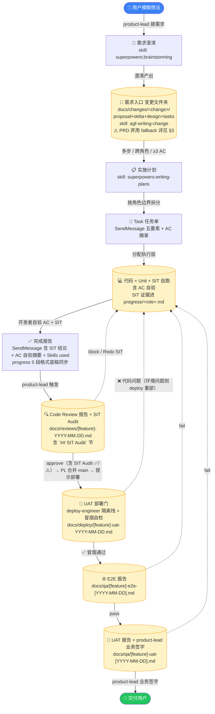
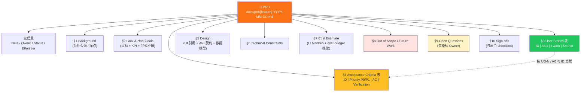
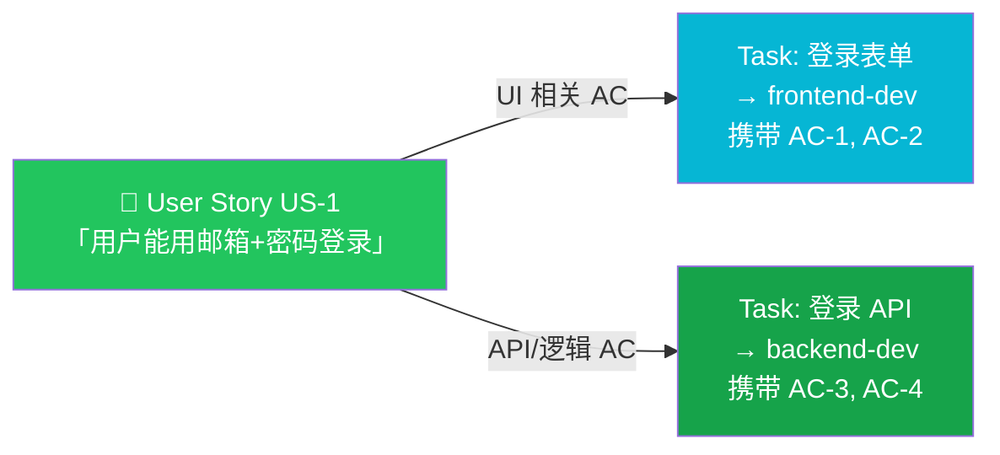

# AppGenesisForge — 产品交付工作流与术语词典

> 角色通信图与**端到端全景图**（角色 + 阶段门 + hook + skill 叠加）见 [`team-capability-map.md`](./team-capability-map.md)。
> 本文档回答"**什么产物在什么阶段产生 / 它们如何分解**"以及"**这堆术语都是什么意思**"。

## 如何使用本文档

本文档定义产品从"想法"到"交付"的工件流转和术语规范。三类读者入口不同：

- **新加入团队的人类成员** → 先读 [§4 术语词典](#4-术语词典) → 再读 [§2 鸟瞰图](#2-鸟瞰产品交付全景流程)；遇到不懂的缩写直接查词典。
- **AI agent（特别是 `product-lead`）** → [§3 解剖](#3-解剖prd-如何分解到-task) 是拆分规范，[§4 术语词典](#4-术语词典) 是对外解释源。
- **模板使用者（用 AppGenesisForge 起项目的人）** → [§2 鸟瞰图](#2-鸟瞰产品交付全景流程) 看 AI 团队的产出流程；[§3 解剖](#3-解剖prd-如何分解到-task) 看 PRD 如何拆到 Task。

> 本文档**不重复**已有规范，只做"统领视角 + 术语词典"；具体执行规则跳转：
> - 角色通信：[`team-capability-map.md`](./team-capability-map.md)
> - 团队工作流：[`.claude/standards/workflow.md`](../.claude/standards/workflow.md)
> - AC 验收生命周期：[`.claude/standards/ac-lifecycle.md`](../.claude/standards/ac-lifecycle.md)
> - 需求入口：**变更文件夹** [`docs/changes/`](./changes/README.md)（skill `agf-writing-change`，取代 PRD；[ADR-012](./adr/012-spec-driven-change-folders.md)）+ 活规格 [`docs/specs/`](./specs/README.md)（行为 SSOT）
> - ⚠️ PRD 模板（**已弃用，仅 fallback**）：[`docs/prd/_TEMPLATE.md`](./prd/_TEMPLATE.md)
> - 需求拆分行事原则：[`.claude/agents/product-lead.md`](../.claude/agents/product-lead.md)

---

## 2. 鸟瞰：产品交付全景流程

### 2.1 全景图

> ⚠️ 下图入口节点是**变更文件夹** `docs/changes/`（skill `agf-writing-change`，[ADR-012](./adr/012-spec-driven-change-folders.md)）；PRD 留 fallback 标注（分解详 §3）。

**视觉约定**：
- 圆柱形 `[(...)]` = 持久工件（有落地路径）
- 矩形 `[...]` = 中间状态（不持久化）
- 圆角胶囊 `([...])` = 起点 / 终点
- 实线 = happy path；虚线 = 失败回路（任一阶段失败都回 `IMPL`）

### 2.2 阶段一句话

| # | 节点 | 说明 | 跳转 |
|---|---|---|---|
| 1 | 用户模糊想法 | 任何形式的输入（一句话 / 截图 / 草图） | — |
| 2 | 需求澄清 | `product-lead` 调用 `superpowers:brainstorming` 收敛 MVP、识别开放问题 | [`product-lead.md` Step 0](../.claude/agents/product-lead.md) |
| 3 | **变更文件夹** | 需求入口（取代 PRD，[ADR-012](./adr/012-spec-driven-change-folders.md)）：proposal + specs delta + design + tasks，**本次变更的权威源**；delta 交付后 merge 进活规格 `docs/specs/`。~~PRD~~ 弃用（fallback） | [`changes/README.md`](./changes/README.md) |
| 4 | 实施计划 | `product-lead` 调用 `superpowers:writing-plans`；**多步 / 跨角色 / ≥3 AC** 三条件任一命中即**强制** | [`product-lead.md` Step 0](../.claude/agents/product-lead.md) |
| 5 | Task 任务单 | `SendMessage` 消息体 + `TaskCreate`；必须摘录 AC 原文，不可只给路径 | [`product-lead.md` Step 2](../.claude/agents/product-lead.md) |
| 6 | 代码 + Unit + **SIT 自跑** | 执行层（`frontend-dev`/`backend-dev`/`ai-agent-dev`/`ml-engineer`/`miniapp-dev`）实现 + Unit + SIT，按 skill `agf-running-sit-tests` 流程；证据进 `progress/<role>.md` 的 `**SIT 证据**` 段 | [`agf-running-sit-tests`](../.claude/skills/agf-running-sit-tests/SKILL.md) / [`ac-lifecycle.md` DoD](../.claude/standards/ac-lifecycle.md) |
| 7 | 完成报告 | 含每条 AC 自验结果（✅/⚠️）+ SIT 段链接 + 调用过的 skills 列表 | [`ac-lifecycle.md`](../.claude/standards/ac-lifecycle.md) |
| 8 | **Code Review + SIT Audit** | `code-reviewer` 审查代码 + audit `progress/<role>.md` 里的 SIT 证据；只输出 `docs/reviews/`，verdict 含 `## SIT Audit` 节（`✅ Pass / ⚠️ Pass with concerns / ❌ Redo SIT`） | [`code-reviewer.md`](../.claude/agents/code-reviewer.md) |
| 9 | **UAT 部署门** | code review 通过 + `product-lead` 合并 main 后，`deploy-engineer` 部署与 dev worktree 物理隔离的 UAT 栈（独立 compose project + 端口偏移 +900）并冒烟自检；二元 gate（`✅ 部署成功（冒烟通过）/ ❌ 部署失败`，不进 verdict 词表）；报告 `docs/deploy/[feature]-uat-[YYYY-MM-DD].md` | [`agf-deploying-uat`](../.claude/skills/agf-deploying-uat/SKILL.md) |
| 10 | **E2E** | End-to-End Testing，浏览器/真机用户路径；qa-engineer 对 deploy-engineer 部署的**共享 UAT 栈**测，用 `chrome-devtools-mcp`，报告用 skill `agf-writing-qa-report` | [`agf-writing-qa-report`](../.claude/skills/agf-writing-qa-report/SKILL.md) |
| 11 | **UAT + 签字** | User Acceptance Testing；`qa-engineer` 出报告（skill `agf-writing-qa-report`）+ `product-lead` 对照 PRD AC 业务签字 | [`ac-lifecycle.md`](../.claude/standards/ac-lifecycle.md) |
| 12 | Release Notes 草稿 | `content-writer` 在 UAT 通过 24h 内起草，PL 评审后发布 | [`content-writer.md`](../.claude/agents/content-writer.md) |
| 13 | 上线后实验 | `growth-analyst` 上线前定指标 + 上线后 7-14d 出实验报告，验证 PRD 成功指标 | [`growth-analyst.md`](../.claude/agents/growth-analyst.md) |

### 2.3 几个不画进图的事

- **`tech-lead` 咨询**是条件触发的虚线（无 ADR / 新选型 / 重大架构风险），不在主链路上——见 [`workflow.md`](../.claude/standards/workflow.md)。
- **Dynamic Workflow**（可选加速层，显式触发，**不在主链路**；按需自写脚本，模板不再预制——原 `/agf-review-sweep` 已按 [ADR-026](adr/026-template-structural-slimming.md) D5 退役，高风险大 PR 深审改 Review pool 维度分工或内置 `/code-review ultra`）——何时用 / 卫生约束见 [`workflow.md`](../.claude/standards/workflow.md) §何时用 Workflow。写 PRD/ADR 前的只读理解地图走 `/agf-code-map`（codemap，**非 Workflow**，[ADR-021](adr/021-code-understanding-engine.md)）。
- **并行派发**（同一执行层多实例并行处理不同模块）发生在节点 5→6 之间——见 [`workflow.md` Parallel Dispatch](../.claude/standards/workflow.md)。
- **小程序链路**把节点 6/8/10-11 的角色替换为 `miniapp-dev` / `miniapp-code-reviewer` / `miniapp-qa-engineer`（部署门节点 9 仅服务 Web 全栈链路，小程序"部署"= 上传体验版归 miniapp 角色），节点和门槛结构相同——见 [`.claude/standards/miniapp.md`](../.claude/standards/miniapp.md)。
- **进度活文档**：所有 Task 状态变化（节点 5→6→7→8→9→10→11）由 `product-lead` 通过 `TaskCreate` / `TaskUpdate` 实时维护；查看用 `/agf-board`（把 `~/.claude/tasks/` 渲染成实时开发看板 `progress/board.html`；原 `/agf-tasks` 文本表已并入退役，ADR-026 D7）。
- **上线后产物链**（节点 12-13）由 `content-writer` 与 `growth-analyst` 在 UAT 签字后接手，不阻塞主链路签字；可选触发——无对外发布需求或无埋点基础设施时可跳过。术语见 §4.6。
- **版本号增长 + GitHub release** 不画进图：每次合并 main 前 `product-lead` 按 [`versioning.md`](../.claude/standards/versioning.md) 判定 MAJOR / MINOR / PATCH，BREAKING 必带 Migration steps。

---

## 3. 解剖：PRD 如何分解到 Task

> ⚠️ **本节描述的是已弃用的 PRD 模型**。现行需求入口是**变更文件夹** `docs/changes/<change>/`（proposal + delta + design + tasks，skill `agf-writing-change`，[ADR-012](adr/012-spec-driven-change-folders.md)）；AC↔Scenario 映射在 `tasks.md`。本节作 PRD fallback 期的历史说明保留。

### 3.1 PRD 内部分层结构

下图是单个 PRD 文件内部的章节树（以 [`_TEMPLATE.md`](./prd/_TEMPLATE.md) 为准）：

**关键结构选择**（与经典 Agile 不同）：

- **User Story 和 AC 拆成两张同级表**，通过 `US-N` / `AC-N` ID 互相引用，**不**把 AC 嵌套进 User Story。这是工程化优化——QA 直接读 §4 AC 表写测试用例，不用遍历每个 US 的子节点。
- **没有 Epic 层**：`_TEMPLATE.md` 直接 `PRD → User Stories`；仅当 PRD 涵盖大型功能簇（>5 个 User Stories）时，才在 §2 目标声明里口头分组（如"目标 1 涉及 US-1..US-3，目标 2 涉及 US-4..US-7"）。**禁止造私有 Sub-Story / Sub-AC 层级**。
- **Non-Goals (§2) ≠ Out of Scope (§8)**：前者"本次明确不做"（防范围蔓延），后者"以后可能做、本次先排除"（留给 Future Work）；两者都不写代表"会做"。

### 3.2 User Story → Task 的映射

### 3.3 拆分规则（硬性条款）

> **规则 1（拆分边界）**：1 个 User Story 通常 = 1~N 个 Task，**按执行角色或文件归属切**（前端 / 后端 / AI / ML），不按 AC 切。每个 Task 至少携带 1 条 AC，且必须**逐字摘录**到 SendMessage 任务消息里。

> **规则 2（粒度判定）**：单个 Task 应能在**一次会话内**由单个 agent 闭环完成（实现 + Unit 测试 + AC 自验）。若需两个角色协作（前端等后端 API），就拆成两个 Task 并在描述里互相引用。

> **规则 3（AC 不可再拆）**：AC 是叶子节点，是**测试用例的直接来源**。若觉得一条 AC "太大"——拆它本身的可观察结果，而非再切成 Sub-AC。

### 3.4 反例

- ❌ **把 1 条 AC 拆给 2 个 Task**：QA 不知道这条 AC 应由哪个 Task 完成、谁来自验。
- ❌ **1 个 Task 携带 0 条 AC**：即使搭脚手架也要至少 1 条（如"AC-0: `pnpm dev` 启动后首页 200 OK"）。
- ❌ **造 Sub-Epic / Sub-Story**：层级超过 `PRD → User Story → AC → Task` 这条链就是过度设计。
- ❌ **任务消息里只放 PRD 路径而不摘录 AC**：teammate 不继承会话上下文，必须显式摘录——见 [`product-lead.md` Step 2](../.claude/agents/product-lead.md)。

---

## 4. 术语词典

> 三栏：**本项目术语 | 行业等价物 + 来源 | 本项目格式 / 引用**；"行业等价物"指出"这不是我们造的词，是行业通用的"。

> **模板术语 vs 项目术语的边界**：本词典只收录**团队模板级**通用术语（PM 概念 + agent team 协作动作 + 测试层级 + 状态指示符）。**具体项目**（基于本模板起的真实产品）沉淀的项目特有缩写（`Plan 1/2`、`T0-T19`、`E0-E11`、业务模块编码、内部 BUG 编号、项目特有技术栈等）应放该项目自己的 `docs/glossary.md`，**不回流本模板**。

### 4.1 产物类

| 本项目术语 | 行业等价物 + 来源 | 本项目格式 / 引用 |
|---|---|---|
| **PRD** | Product Requirements Document（通用 PM 术语，源自 Marty Cagan《Inspired》等） | `docs/prd/[feature]-YYYY-MM-DD.md`，10 节结构 / [`_TEMPLATE.md`](./prd/_TEMPLATE.md) |
| **User Story** | Agile 用户故事，遵循 INVEST 原则（Bill Wake, 2003） | `As a [角色] / I want [操作] / So that [目标]`；放 PRD §3 表格，ID 形如 `US-1` |
| **AC** | Acceptance Criteria（ISO/IEC/IEEE 29148-2018） | `当 [触发条件] 时 / [可观察结果]`；放 PRD §4 表格，ID 形如 `AC-1`；优先级 P0/P1 |
| **Epic** | SAFe / Jira 的功能簇概念 | **本项目可选**：仅大型 PRD（>5 User Stories）口头分组，不造结构化层级 |
| **Task / 任务单** | Agile generic | `SendMessage` 消息体 + `TaskCreate`；6 段 schema：任务描述 / 任务类型 / 上下文 / 上游产物 / 验收标准 / 预期产物（详见 [`product-lead.md` Step 2](../.claude/agents/product-lead.md)；hook `validate-task-schema.sh` 强制） |
| **完成报告** | Status Report（PMI） | `SendMessage` 回 `product-lead`，含 SIT 结论 + AC 自验摘要 ✅/⚠️ + `Skills used:` 字段；`progress/<role>.md` 底稿走 5 段格式（状态 / Skills / SIT 证据 [含 AC `[x]/[ ]` 内联] / 质量门 / 下一步） |
| **Code Review 报告** | Code Review（行业通用） | `docs/reviews/[feature]-YYYY-MM-DD.md`；verdict: `approve` / `approve with changes` / `block`（3 档，与 [`code-reviewer.md`](../.claude/agents/code-reviewer.md) 严格对齐）；问题分级 **Critical / Warning / Suggestion**，简写 `C-1` / `W-1` / `S-1` |
| **SIT 证据** | System Integration Testing evidence（IEEE 829-2008 派生） | 由 dev 自跑后写入 `progress/<role>.md` 的 `**SIT 证据**` 段（按 [`agf-running-sit-tests`](../.claude/skills/agf-running-sit-tests/SKILL.md)）；UAT 通过后随 `progress/*.md` 一并归档进 `docs/qa/<feature>-process-log.md`；不独立产 `docs/qa/*-sit-*.md` |
| **SIT Audit** | reviewer 对 SIT 证据的独立性 audit（本项目新定义，非行业术语） | code-reviewer 在 `docs/reviews/[feature]-YYYY-MM-DD.md` 的 `## SIT Audit` 节，verdict 三档：`✅ Pass / ⚠️ Pass with concerns / ❌ Redo SIT` |
| **E2E 报告** | End-to-End Testing report | `docs/qa/[feature]-e2e-[YYYY-MM-DD].md`（必带日期后缀，re-run 同 feature 不撞名）；前端用 `chrome-devtools-mcp`；写报告用 skill `agf-writing-qa-report` |
| **UAT 报告 + 签字** | User Acceptance Testing（IEEE 829-2008） | `docs/qa/[feature]-uat-[YYYY-MM-DD].md`（必带日期后缀）；写报告用 skill `agf-writing-qa-report`；`product-lead` 是唯一签字角色 |
| **ADR** | Architecture Decision Record（Michael Nygard, 2011） | `docs/adr/NNN-[topic].md`，由 `tech-lead` 输出 |
| **Release Notes / Blog / Case** | Release Notes（[Keep a Changelog](https://keepachangelog.com/) 行业惯例） | `docs/content/{release-notes,blog,case}/[YYYY-MM-DD]-[slug].md`，由 `content-writer` 撰写；UAT 通过后 24h 内交草稿；详见 [`content-writer.md`](../.claude/agents/content-writer.md) |
| **实验设计 / 实验报告** | A/B Testing & Analysis（行业通用） | `docs/growth/experiments/[name]-[YYYY-MM-DD].md`，由 `growth-analyst` 撰写；上线前定假设 / 北极星 / Counter Metric / 停测准则；上线后 7-14d 出报告含 p-value + 置信区间 + effect size |

### 4.2 流程 / 状态类

| 本项目术语 | 行业等价物 + 来源 | 本项目格式 / 引用 |
|---|---|---|
| **MVP** | Minimum Viable Product（Eric Ries《Lean Startup》） | `product-lead` 在 brainstorming 阶段定义；体现在 PRD §2 Goal / §8 Out of Scope |
| **DoD** | Definition of Done（Scrum Guide） | [`ac-lifecycle.md` Definition of Done](../.claude/standards/ac-lifecycle.md) |
| **Out of Scope** | 通用 PM 术语 | PRD §8；标"以后可能做" |
| **Non-Goals** | Google PM 文化（与 Goals 配对） | PRD §2；标"本次明确不做"（≠ Out of Scope）|
| **Open Questions** | 通用 PM 术语 | PRD §9；**每条必须标 Owner**，否则不允许进入 Step 2 任务分配 |
| **Stage Gate** | Robert Cooper Stage-Gate® 模型 | 本项目固定 7 阶段门（PRD → 派单 → 实现+Unit+SIT 自跑 → Code Review 含 SIT Audit → **UAT 部署门**（deploy-engineer 隔离栈+冒烟，二元 gate）→ E2E → UAT 签字）；SIT 合入 dev DoD（不独立成 phase）。完整流程图 + 失败回退规则见 [`workflow.md`](../.claude/standards/workflow.md) 主流程 / `team-capability-map.md §1.1`（权威，本条不重复）|
| **GA** | General Availability（发布管理通用术语） | "feature GA" = 走完所有阶段门并完成 product-lead 业务签字 |
| **α / β** | Alpha / Beta 阶段（通用产品术语） | 模板不规定语义；项目可自定义（典型：α = 内部可用 / β = 受限外部） |
| **dogfooding** | "吃自己的狗粮"（Microsoft 1988） | 团队内部自用产品收集反馈的中间阶段；通常在 α 之后、β 之前 |
| **MoSCoW** | DSDM Consortium（Dai Clegg, 1994） | **本项目用 P0/P1 优先级，不采用 MoSCoW** |
| **P0 / P1 / P2** | 通用严重级 / 优先级（IEEE / ISO） | PRD §4 AC 表使用：P0 = 必须 / P1 = 应该 / P2 = 可选（[`_TEMPLATE.md`](./prd/_TEMPLATE.md)） |

### 4.3 测试类

| 本项目术语 | 行业等价物 + 来源 | 本项目格式 / 引用 |
|---|---|---|
| **Unit 测试** | Unit Testing（Kent Beck） | 由开发者写，与代码同 PR；前端 Vitest / 后端 pytest |
| **SIT** | System Integration Testing（IEEE 829） | 由**执行层 dev 自跑**（不独立成 phase），证据落 `progress/<role>.md`，code-reviewer 在 code review 时 SIT Audit；重点：API 契约 / 数据库状态 / 错误处理 |
| **E2E** | End-to-End Testing | `qa-engineer` 执行；浏览器自动化 / 真机（小程序） |
| **UAT** | User Acceptance Testing（IEEE 829） | `qa-engineer` 出报告 + `product-lead` 对照 PRD §4 AC 业务签字 |
| **AC 自验** | Self-verification（Agile DoD 子条款） | 开发者提交完成报告前必做；逐条标 ✅/⚠️ |

### 4.4 Agile / Scrum 心法：采用清单 + 词汇替代

> **本项目是 Agile Scrum 模板**，TDD 与 Agile/Scrum 心法是核心思想（不可妥协），但不采用 Scrum 全套词汇（Sprint / Backlog / Velocity / Daily Standup 等）。原因不是反对 Scrum，而是 **AI Agent Team 协作模式下定时迭代不适用**——feature 流（每个 feature 从 PRD 到 UAT 是一个迭代单元）更匹配 Agent Team 的连续异步协作特性。

#### 心法采用（与 Agile / Scrum 完全一致，强制）

| Agile / Scrum 实践 | 本项目对应 / 强制点 |
|---|---|
| **Test-Driven Development**（核心思想 1）| `superpowers:test-driven-development` 强制 + [`ac-lifecycle.md` DoD](../.claude/standards/ac-lifecycle.md) red-green-refactor 顺序（PR commit history 能看出 test 早于 impl）|
| **Acceptance Criteria (AC)** | PRD §4 表 + 每条 ≤30s 可验证 + code-reviewer SIT Audit / qa-engineer E2E 逐条核对 |
| **Definition of Done (DoD)** | [`ac-lifecycle.md`](../.claude/standards/ac-lifecycle.md) 强制 **10 项**（含 TDD red→green→refactor 顺序 / Unit / SIT 自跑 / AC 自验 / progress 落档 5 段 / SendMessage 引用 / verdict 衔接 / UAT 业务签字 等，详见 ac-lifecycle.md 完整清单）|
| **User Story** | PRD §3 表，As-a / I-want / So-that 格式，与 §4 AC 表通过 ID 互相引用 |
| **Cross-functional team** | 15 角色横跨需求 / 设计 / 前后端 / AI / ML / 测试 / 部署 / 内容 / 增长 |
| **Iterative delivery** | feature 流：每个 feature 从 PRD → UAT 签字是一次完整迭代 |
| **Continuous integration testing** | Unit + SIT + E2E + UAT 四级测试，阶段门递进，前一级通过才进入下一级 |
| **Retrospective** | Release retrospective（`/agf-release-retro vX.Y.Z`，MAJOR/MINOR **建议·提醒，非强制 gate**；按 [`agf-running-release-retro`](../.claude/skills/agf-running-release-retro/SKILL.md) skill 走 7 步），产物归档 `docs/reviews/retro-vX.Y.Z-YYYY-MM-DD.md` |
| **Definition of Ready (DoR)** | `product-lead` Step 0 强制 `superpowers:brainstorming` 澄清 + AC 必须 ≤30s 可验证；澄清通过 = ready |
| **Refinement / Grooming** | `superpowers:brainstorming` + `writing-plans` 串行调用（异步精炼，无需定时会议）|
| **Persona** | 写入 PRD §1 Background 段落（轻量，不单独成节）|

#### Scrum 全套词汇的本项目替代（功能等价，词汇不同）

| Scrum 词汇 | 本项目替代 | 替代理由 |
|---|---|---|
| **Sprint**（1-4 周定时迭代）| Feature 流（每 feature 独立迭代单元） | Agent Team 连续异步协作，无 sync 节奏 → 无固定时间窗 |
| **Backlog**（待办事项池）| `docs/prd/` 目录里 Status=Draft/Review 的 PRD | 需求池仍存在，只是文件化（git-trackable）|
| **Story Points**（Fibonacci 估点）| PRD `Estimated effort tier: Small/Medium/Large` | 与 [`cost-budget.md`](../.claude/standards/cost-budget.md) token 档位绑定，比抽象 points 更精确（直接转 token 预算）|
| **Velocity / Burndown**（迭代效率指标）| 不统计 | 无定时迭代 → velocity 无意义；用 release 节奏 + retro AI 闭环替代效率追踪 |
| **Daily Standup**（每日站会）| `progress/<role>.md` 持久化 + SendMessage 完成报告 | Agent Team 异步协作 = async standup；hook `check-progress-file` 兜底 |
| **Sprint Review**（迭代评审会）| 每 feature 的 UAT 签字 + release retrospective | 等价的 demo + 签字仪式 |
| **Sprint Planning**（迭代规划会）| `superpowers:writing-plans` skill | 异步规划，不需要会议 |

> 模板只声明**默认不采用 Scrum 全套词汇**，不阻止具体项目重新定义。真实项目可在自己的 CLAUDE.md / glossary 里借用 "Sprint" 标记 Plan 内的时间分段（如 `S9` = 第 9 个 sprint）、借用 "Backlog" 当未进 Plan 的需求池——与 Scrum 原义不同但对项目内部沟通有效。

### 4.5 协作动作（Collaboration Actions）

> 本节是 **agent team 运行时**术语（区别于 §4.1-4.3 的 PM/Agile 词汇），模板使用者每天高频遇到。

| 本项目术语 | 含义 | 触发场景 / 引用 |
|---|---|---|
| **派工 / dispatch** | `product-lead` 通过 SendMessage 把 Task 分配给执行层 | 鸟瞰图节点 5→6；五要素 + AC 摘录 |
| **escalate** | 向上级请决策（执行层 → product-lead → user；或 code-reviewer → tech-lead 处理架构风险） | 任何阻塞 / 越权 / 跨角色未决问题 |
| **halt / STOP** | 紧急停机：hook 阻断、测试 fail、spec drift 等触发；**必须停手并向上报告，不允许私自绕过** | 对应符号 ⛔；详见 [`security.md` No Equivalent Bypass](../.claude/standards/security.md) |
| **mailbox** | SendMessage 的 `to` 字段对应的 agent 实例名 / ID（如 `product-lead`、`backend-dev-2`） | 并行派发时区分实例 |
| **ghost mailbox** | 往不存在或已销毁的 mailbox 派工（如 `qa-engineer-2` 已删但仍发） | agent team 常见运行时坑 |
| **push back** | 接到 review 反馈后基于实测**有理据反对**（如"我跑了 mypy strict 实际通过，反对这条 warning"） | 配合 `superpowers:receiving-code-review` |
| **ack** | acknowledge — 确认收到 | SendMessage 短回复 |
| **standby / idle** | 待命，等下一个任务 | 对应符号 💤；不允许在 task list 还有 pending 时 idle（[`teammate-keepalive.sh` hook](../.claude/hooks/teammate-keepalive.sh) 拦截） |
| **verify-before-assert** | 报"完成"之前**必须实跑验证**，不空口宣布 | 对应 `superpowers:verification-before-completion` skill |
| **verify** | `product-lead` 在执行层报完成后**亲跑** git log / grep / curl 核对真伪 | 鸟瞰图阶段 7→8 之间的 sanity check |
| **sender 归因混淆** | teammate 把消息发出方搞错（把 user 直派工误归为 product-lead 派工） | agent team 常见 bug；TaskCreate 时显式标 owner 可避免 |
| **sweep** | `product-lead` 主动 git log + task list + mailbox 全扫一遍 | 接手长期任务 / 怀疑遗漏时 |
| **mock-first** | 前端先用 mock 数据实现 UI，等 backend 就绪后切真接口 | API 契约确定后的并行模式 |
| **schema drift / spec drift** | 文档/PRD/spec 中的契约与实际代码或数据库**不一致** | 触发 STOP；通常由 verify-before-assert 发现 |

### 4.6 上线后 / Release 类

> Feature 进入生产后才出现的术语；本节只做术语索引，规则细则分别见 [`content-writer.md`](../.claude/agents/content-writer.md) / [`growth-analyst.md`](../.claude/agents/growth-analyst.md) / [`versioning.md`](../.claude/standards/versioning.md)。

| 本项目术语 | 行业等价物 + 来源 | 本项目格式 / 引用 |
|---|---|---|
| **Release Notes** | Keep a Changelog format | `docs/content/release-notes/[YYYY-MM-DD]-[slug].md`；动词开头标题（Added / Changed / Fixed / Removed / Security）；≤200 字 |
| **北极星指标 / North Star Metric** | Sean Ellis growth-hacking 术语 | 实验设计中的 OMTM；每个上线后实验必有 |
| **OMTM** | One Metric That Matters（Lean Analytics） | 同北极星，本项目两词通用 |
| **Counter Metric** | 实验防御指标（行业通用） | 防止"赢北极星但伤体验"——例：转化率提升的实验加客服 ticket 作为 counter |
| **A/B Test** | A/B Testing 行业通用术语 | `growth-analyst` 设计 + `product-lead` 批准 + `backend-dev` 埋点 |
| **MDE / Sample Size** | Minimum Detectable Effect | 实验设计阶段算清，避免不显著就停 |
| **停测准则 / Stopping Rule** | 双尾 p<0.05 / 14d / counter 恶化任一触发 | 实验设计模板必有 |
| **Hold-out 组** | Holdout group（控制组保留策略） | 长期实验保留 5-10% 流量不发版本，追踪长期影响 |
| **Effect Size** | 效应量（统计学） | p-value 通过后还要看 effect size：太小（<1pp）即使显著也建议不推广 |
| **vibe** | persona 一句话标签（本项目自创） | agent frontmatter 中 ≤80 字符的"性格信号"，仅用于 README 表格展示，无运行时语义 |
| **SemVer / MAJOR / MINOR / PATCH** | [Semantic Versioning 2.0.0](https://semver.org/) | 触发器细则见 [`versioning.md`](../.claude/standards/versioning.md) |
| **BREAKING** | API breakage marker（行业通用） | CHANGELOG / Release notes 标题加 `(BREAKING)` + 顶部"Why" + 底部"Migration steps" |
| **Migration steps** | Upgrade guide（行业通用） | 每个 MAJOR 必含 `Migration steps for users on vX.x` 节 |
| **Annotated Tag** | git annotated tag | `git tag -a vX.Y.Z -m "..."`；本项目禁用 lightweight tag |
| **Deprecation 期** | Deprecation window（行业通用） | 删除前至少 1 个 MINOR 版本的标注期；例外：未发布的实验性产物可在 MAJOR 直接删 |

### 4.7 状态指示符

> 团队约定的 emoji 集合，用于完成报告 / 任务状态 / 文档 checklist；各 agent 不应自创符号。

| 符号 | 含义 | 典型出现位置 |
|---|---|---|
| ✅ | 完成 / 通过 | AC 自验、Code Review verdict、UAT 签字 |
| ⚠️ | 警告 / 有偏差 / 需注意 | AC 自验有偏差、Code Review Warning |
| ❌ | 失败 / 不通过 | 测试失败、Code Review `block`、UAT 业务签字 `request changes` |
| 🔄 | 进行中 | Task 状态、长任务进度 |
| ⏸ | 暂停 / pending | 等待外部依赖 / 等待澄清 |
| 💤 | idle / standby | teammate 待命中 |
| ⛔ | STOP / halt | 紧急停机协议触发（hook 阻断 / spec drift / 测试 fail） |

---

## 5. 维护说明

- **本文档由 `product-lead` 维护**。[`_TEMPLATE.md`](./prd/_TEMPLATE.md) / [`workflow.md`](../.claude/standards/workflow.md) / [`ac-lifecycle.md`](../.claude/standards/ac-lifecycle.md) 中任一变更影响产物结构或阶段门槛时，必须同步更新本文档。
- **术语词典只增不删**：移除一个术语前，必须确认它在所有 agent / standards / docs 中均无引用。
- **Mermaid 图修改后需肉眼检查渲染**：在 GitHub / VSCode Markdown 预览中确认无语法错误。
