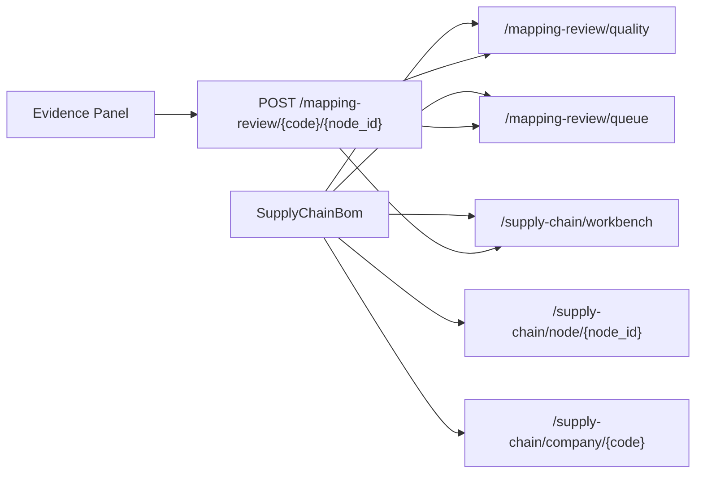

# Supply Chain Research Workbench Design

## Goal

将现有“大葱产业链拆解”页面升级为投研工作台：用户可以在一个屏幕内完成产业链节点下钻、候选公司对比、证据查看和映射复核。

## Scope

本阶段只改前端工作台体验，复用已完成的后端能力：

- `/api/v1/screener/supply-chain/workbench`
- `/api/v1/screener/supply-chain/node/{node_id}`
- `/api/v1/screener/supply-chain/company/{code}`
- `/api/v1/screener/supply-chain/mapping-review/quality`
- `/api/v1/screener/supply-chain/mapping-review/queue`
- `/api/v1/screener/supply-chain/mapping-review/{code}/{node_id}`

不新增数据库迁移，不新增交易相关能力，不改变模型评分算法。若需要补后端字段，只允许做兼容式字段扩展。

## Chosen Layout

采用三栏投研台：

| 区域 | 职责 | 主要内容 |
|---|---|---|
| 左栏 | 定位节点 | 产业链树、hotspot、待复核压力、节点摘要 |
| 中栏 | 筛选与对比 | 候选公司表、筛选器、映射调整分、多选对比栏 |
| 右栏 | 证据与判断 | 单家公司证据链、财务/研报/映射复核、操作按钮 |

设计目标是让用户按“节点 → 候选 → 证据 → 复核/研究判断”的顺序工作，不再在多个纵向区块里来回滚动。

## User Workflow

1. 用户进入产业链工作台，默认展示全局候选 Top30 和质量概览。
2. 用户在左栏点击产业链节点，例如“半导体 / 材料”。
3. 中栏刷新为该节点候选公司，并显示节点候选数量、映射状态和调整后排序。
4. 用户点击一家公司，右栏打开该公司的证据面板。
5. 用户可勾选 2-4 家公司，中栏底部展示候选对比栏。
6. 用户在右栏查看证据缺口，执行“确认 / 补证据 / 驳回”。
7. 复核结果写回后，刷新左栏质量压力、中栏候选排序和右栏状态。

## Interaction Details

### Left Column: Node Drilldown

左栏是固定宽度导航区，包含：

- 产业链树：按产业链、层级节点展示。
- hotspot 标记：显示节点待复核压力，优先展示 `pending_review + weak_evidence` 高的节点。
- 状态标签：`verified`、`pending_review`、`weak_evidence`、`rejected`。
- 节点摘要：展示当前节点 thesis、关键词、触发条件、风险和候选数量。

点击节点后：

- 更新 `selectedNodeId`。
- 调用 workbench 接口刷新节点候选。
- 调用 node detail 接口刷新节点上下文。
- 刷新复核队列筛选条件。

### Middle Column: Candidate Comparison

中栏是主工作区，表格必须适配投研场景：

- 横向滚动，不允许核心列内容挤压换行。
- 默认列：公司、行业、链路节点、原始分、映射调整分、映射状态、证据来源、行情、交易信号。
- 支持状态筛选：全部、已确认、待复核、弱证据。
- 支持多选候选，最多 4 家进入对比栏。
- 对比栏展示收入增速、利润增速、ROE、毛利率、映射可信度、证据来源、证据缺口数量和信号状态。

候选排序优先使用 `mapping_adjusted_score`，没有该字段时回退到 `score` 或 `total_score`。

### Right Column: Evidence Panel

右栏展示当前候选公司的研究证据：

- 顶部：公司名、代码、映射状态、置信度、映射来源。
- Tabs：证据链、财务、研报、复核。
- 证据链：主营业务命中、简介命中、研报命中、证据缺口。
- 财务：收入增速、利润增速、ROE、毛利率、最新报告期。
- 研报：报告标题、券商、发布日期、覆盖数量。
- 复核：确认、补证据、驳回。

复核动作写回成功后，右栏状态立即更新，并触发左栏和中栏刷新。

## Data Flow

## Component Structure

目标是拆小现有 `SupplyChainBom.tsx`，避免继续堆叠。

| 组件 | 职责 |
|---|---|
| `SupplyChainResearchWorkbench.tsx` | 三栏布局容器，维护选中节点、选中公司、对比列表 |
| `SupplyChainNodeNavigator.tsx` | 左栏节点树、hotspot、节点摘要 |
| `SupplyChainCandidateGrid.tsx` | 中栏候选表、筛选、多选 |
| `CandidateCompareBar.tsx` | 中栏候选横向对比 |
| `CompanyEvidencePanel.tsx` | 右栏证据、财务、研报、复核 |
| `SupplyChainMappingReviewPanel.tsx` | 复核队列能力，保留为可嵌入模块 |

现有组件复用：

- `ChainTreeChart`
- `CandidateCompanyTable` 的列渲染逻辑可迁移或复用。
- `CompanyResearchDrawer` 中的证据展示逻辑可下沉到 `CompanyEvidencePanel`。
- `NodeThesisPanel` 可嵌入左栏节点摘要。

## Visual Rules

- 工作台是工具界面，不做营销式 hero。
- 表格保持高密度、低装饰、便于扫描。
- 核心表格统一 `scroll.x`，单元格默认不换行。
- 卡片只用于明确的工具面板，不做卡片套卡片。
- 重要状态用 Ant Design `Tag`，操作按钮带图标。
- 宽屏下三栏并排；窄屏下降级为上下顺序：节点、候选、证据。

## Loading And Error States

- 首屏：三个栏位可独立 loading，不阻塞整个页面。
- 节点候选为空：中栏显示“该节点缺少公司映射证据”，不回退全局候选。
- 公司证据缺失：右栏展示证据缺口，而不是空白。
- 复核写回失败：保留当前状态并提示错误。
- 后端字段缺失：前端以 `--`、空数组或“待补证据”兜底。

## Acceptance Criteria

- 用户能在左栏点击节点并刷新中栏候选。
- 用户能点击候选并在右栏看到证据链、财务指标和复核状态。
- 用户能勾选至少 2 家候选并看到对比栏。
- 用户能从右栏执行确认、补证据、驳回，并刷新质量统计。
- 核心表格在桌面宽度下不发生难读的自动换行。
- 移动或窄屏下布局可纵向阅读，不互相遮挡。
- 新增组件有单元测试覆盖：节点选择、候选选择、候选对比、复核动作。
- 现有复核台测试继续通过。

## Out Of Scope

- 不做真实交易动作。
- 不做新后端数据源采集。
- 不做 AI 自动结论生成。
- 不做权限系统改造。
- 不做导出 PDF 或研报生成。

