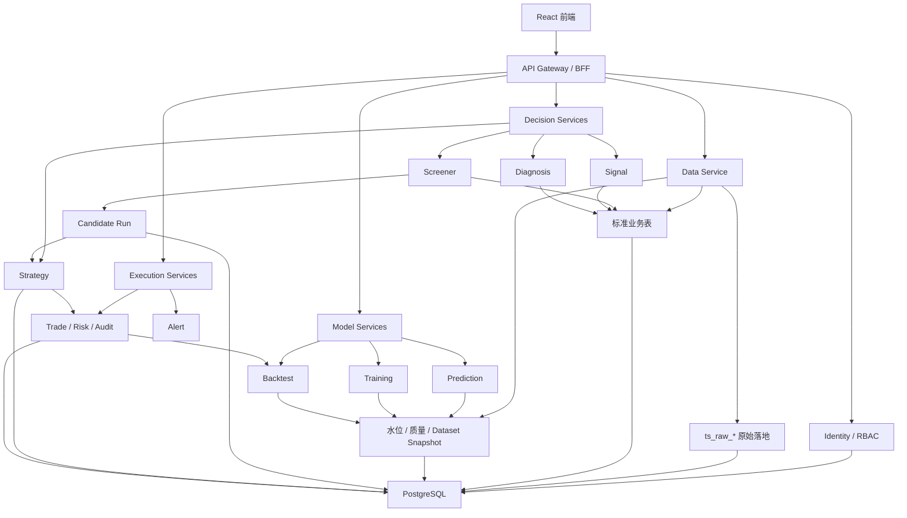

# 平台五域可信度与可维护性治理详细设计

- **Date**: 2026-07-10
- **Status**: Draft for review
- **PRD**: `docs/prd/platform-five-domain-optimization-2026-07-10.md`
- **Scope**: 前端、后端、架构、数据采集、算法模型

## 1. 设计决策

本方案选择演进式边界收敛。团队保留 React、FastAPI、PostgreSQL、Redis 和现有服务，通过禁止伪数据、统一契约、数据门禁、模型门禁和模块拆分降低风险。

| 方案 | 优点 | 代价 | 结论 |
|---|---|---|---|
| 局部修补 | 短期改动少 | 继续积累接口、数据和模型口径漂移 | 不采用 |
| 演进式边界收敛 | 可分批交付，兼容当前系统，便于回滚 | 迁移期保留兼容层 | 采用 |
| 全量重写并引入消息队列、独立数据库和 Kubernetes | 边界干净 | 迁移面过大，运维成本超出当前需求 | 不采用 |

本期不增加微服务，不引入 Kafka、Celery、GraphQL、Next.js 或新数据库。长任务先用 PostgreSQL 持久化状态和 advisory lock 管理。微服务 HTTP 调用继续遵守项目约定，使用 `urllib + run_in_executor`。

## 2. 不能继续保留的当前行为

以下路径会把缺少证据伪装成正常结果，必须在第一阶段关闭。

| 位置 | 当前行为 | 目标行为 |
|---|---|---|
| `services/api-gateway/app/main.py` | workbench 返回 `CTX-preview`、47 个候选、11/11 服务在线等固定值 | 查询真实服务；查询不到则返回 `unavailable` |
| `frontend/src/pages/DataUpdate.tsx` | 请求失败后显示固定 98.2 万行和固定历史日期 | 显示 unknown、错误原因和重试入口 |
| `frontend/src/pages/Screener.tsx` | 把因子分数均值命名为 IC，人工构造相关性和分层收益 | 只展示真实 backtest/factor API 数据 |
| `services/backtest-service/app/routes.py` | 用历史涨幅代理预测，用市场均值生成因子 IC 和权重 | 接入真实因子快照；未接入前返回 `unsupported` |
| `services/training-service/app/factor_calibration.py` | 使用随机数生成 IC/ICIR 并可应用权重 | 生产路径拒绝运行；随机路径仅限显式 test fixture |
| `services/training-service/app/routes.py` | 指标缺失时补固定 IC、Sharpe 和年化收益 | 返回 `insufficient_data`，不做比较和晋级 |
| `services/signal-service/app/routes.py` | Kronos 缺失时固定补 50 分 | 将该维度标为 unavailable，并重新计算 coverage |
| `services/trade-service/app/xtquant_broker.py` | SDK 已连接但真实方法未接通时回落 stub | live readiness blocked，所有 live 请求失败关闭 |

统一规则：投资、模型、回测和实盘结论缺少真实观测时，只返回 `unavailable`、`unsupported` 或 `insufficient_data`。系统不得补一个看似合理的数字。

## 3. 目标架构



### 3.1 服务职责

| 服务 | 唯一职责 | 禁止事项 |
|---|---|---|
| api-gateway | 路由、认证上下文、限流、request ID、页面级真实聚合 | 不生成业务数字，不直接写业务库 |
| backend | JWT、用户、租户、会员、权限和账户归属 | 不承载行情、模型或交易规则 |
| data-service | 采集、调度、raw、标准表、水位和质量 | signal-service 不再代理采集 |
| screener-service | 模型运行编排、候选池和产业链决策 | 不挂训练 mock，不直接启动采集脚本 |
| signal-service | 真实信号计算和历史查询 | 缺失维度不得补默认分数 |
| diagnosis-service | 诊断计算和报告 | 缺数据时必须返回 coverage |
| strategy-service | Plan 生命周期和自动策略编排 | 生产状态不得以内存为主真相源 |
| training-service | 数据集、训练、注册和晋级审批 | synthetic/mock 结果不得晋级 |
| prediction-service | 加载已批准模型并推理 | 不自动拿最新文件冒充生产模型 |
| backtest-service | 可信回测、样本外验证和模型比较 | 不生成缺失指标，不修改策略参数 |
| trade-service | 账户、委托、持仓、风控、审计和券商适配 | 真实券商未接通时不得模拟成交 |
| alert-service | 通知和告警投递 | 不参与核心交易判断 |

### 3.2 路由所有权

外部 URL 保持不变，网关内部路由收敛如下：

| 外部前缀 | Owner | 目标服务 |
|---|---|---|
| `/api/v1/auth`、`/api/v1/admin` | backend | backend |
| `/api/v1/data` | data-service | data-service:8010 |
| `/api/v1/screener`、`/api/v1/supply-chain`、`/api/v1/dashboard` | screener-service | screener-service:8001 |
| `/api/v1/signal` | signal-service | signal-service:8004 |
| `/api/v1/prediction` | prediction-service | prediction-service:8002 |
| `/api/v1/training` | training-service | training-service:8008 |
| `/api/v1/backtest` | backtest-service | backtest-service:8007 |
| `/api/v1/strategy` | strategy-service | strategy-service:8003 |
| `/api/v1/trade` | trade-service | trade-service:8006 |
| `/api/v1/diagnosis` | diagnosis-service | diagnosis-service:8009 |

迁移期间 signal-service 可以保留 data proxy，但只转发，不再执行 subprocess fallback。前端无需修改 `/api/v1/data` 路径。

## 4. 统一契约

新增内部轻量包 `packages/kronos-contracts`，只放 Pydantic v2 数据结构、枚举和 JSON schema。包内不得包含数据库访问、HTTP 调用或业务计算。

### 4.1 通用元数据

```python
from datetime import datetime
from typing import Any, Literal
from pydantic import BaseModel, Field

ResultStatus = Literal[
    "success",
    "success_no_matches",
    "blocked",
    "insufficient_data",
    "unsupported",
    "failed",
]

class SourceReadiness(BaseModel):
    source: str
    required_as_of: str | None = None
    actual_as_of: str | None = None
    coverage_ratio: float | None = Field(default=None, ge=0, le=1)
    status: Literal["ready", "stale", "incomplete", "unavailable", "optional_missing"]
    reason: str | None = None

class DataReadiness(BaseModel):
    snapshot_id: str
    profile: str
    target_trade_date: str
    cutoff_time: str | None = None
    status: Literal["ready", "degraded", "blocked", "unknown"]
    sources: list[SourceReadiness]
    checked_at: datetime

class ModelMetadata(BaseModel):
    model_key: str
    version: str
    stage: Literal["research", "candidate", "paper", "production"]
    code_commit: str
    parameters_hash: str

class ResponseMeta(BaseModel):
    request_id: str
    run_id: str | None = None
    data_readiness: DataReadiness | None = None
    model: ModelMetadata | None = None
    degraded_sources: list[str] = Field(default_factory=list)
```

现有 v1 响应不整体重包。第一阶段在原响应上增加 `meta`、`result_status` 和 `fallback_reason`，保留旧字段作为兼容层。

### 4.2 标准错误

```json
{
  "status": "error",
  "request_id": "REQ-01J...",
  "error": {
    "code": "DATA_NOT_READY",
    "message": "adj_factor 尚未更新到目标交易日",
    "retryable": true,
    "details": {
      "expected": "2026-07-10",
      "actual": "2026-07-07"
    }
  }
}
```

错误码固定为：

- `DATA_NOT_READY`
- `SOURCE_UNAVAILABLE`
- `MODEL_NOT_READY`
- `INSUFFICIENT_EVIDENCE`
- `STATE_CONFLICT`
- `IDEMPOTENCY_CONFLICT`
- `BROKER_UNAVAILABLE`
- `BROKER_RESULT_UNKNOWN`
- `AUTH_SCOPE_DENIED`
- `INTERNAL_ERROR`

状态码约定：

| HTTP | 用途 |
|---:|---|
| 200 | 同步成功、合法无候选、查询成功 |
| 202 | 长任务已接受，返回持久化 `run_id` |
| 409 | 数据未就绪、状态冲突、幂等冲突 |
| 422 | 请求不符合业务契约 |
| 503 | 必需依赖不可用 |
| 500 | 未预期内部错误，不向外暴露凭据和 SQL |

### 4.3 请求和运行标识

- gateway 生成或接受合法 `X-Request-ID`，向下游透传。
- 长任务创建 `run_id`，同一请求触发的子任务记录 `parent_run_id`。
- 模型输出、策略方案、风控判断和订单记录保留上游 `run_id`。
- 候选 ID 使用 `CAND-{run_id}-{code}`，避免跨日期和跨运行冲突。

## 5. 前端设计

### 5.1 目标目录

```text
frontend/src/
  app/
    routeRegistry.tsx
  api/
    core/http.ts
    core/context.ts
    domains/auth.ts
    domains/data.ts
    domains/screener.ts
    domains/models.ts
    domains/strategy.ts
    domains/trade.ts
    contracts/
    client.ts              # 迁移期兼容 barrel
  components/async/
    AsyncStatePanel.tsx
    DataReadinessBadge.tsx
    ModelStageBadge.tsx
  features/
    dashboard/
    screener/
    supply-chain/
    data/
    models/
    strategy/
    trade/
```

### 5.2 路由注册

```tsx
export interface AppRouteDefinition {
  key: string
  path: string
  aliases?: string[]
  label: string
  group: '行情决策' | '交易执行' | '模型 / 系统' | '平台管理'
  roles: Role[]
  permission: PermissionKey
  navVisible: boolean
  badge?: string
  load: () => Promise<{ default: React.ComponentType }>
}
```

`routeRegistry` 派生菜单、受保护路由、面包屑和页面标题。`App.tsx` 只负责应用壳、全局上下文和渲染派生结果。

### 5.3 API 模块

`api/core/http.ts` 保留 axios 实例、token refresh 和请求 ID；`api/core/context.ts` 只生成允许客户端选择的 tenant/account/trade mode。客户端不得发送 `X-Owner-User-Id` 或 `X-Service-Auth`。

`api/client.ts` 作为兼容 barrel 重新导出域 API。页面迁移完成后再删除旧导出，避免一次改动全部页面。

### 5.4 页面状态

所有核心页面使用同一状态集合：

```ts
export type AsyncViewState =
  | { kind: 'loading' }
  | { kind: 'ready' }
  | { kind: 'empty'; reason?: string }
  | { kind: 'stale'; asOf: string; reason: string }
  | { kind: 'degraded'; sources: string[]; reason: string }
  | { kind: 'blocked'; code: string; reason: string }
  | { kind: 'error'; retryable: boolean; reason: string }
```

`empty` 表示查询成功但没有业务记录；`blocked` 表示数据或模型门未通过；`error` 表示系统调用失败。三者不能互相替代。

投资类页面固定显示数据日期、截止时间、模型版本、模型阶段和降级来源。真实 IC、相关性和分层收益不存在时，页面显示“暂无真实回测数据”。

## 6. 后端模块化设计

### 6.1 测试隔离

新增 `tools/run_service_tests.py`。脚本为每个服务启动独立 Python 子进程，设置该服务自己的 cwd 和 `PYTHONPATH`，避免同名 `app` 包污染。CI 使用 service matrix，禁止在一个 pytest 进程中收集多个服务。

### 6.2 健康检查

每个服务提供：

- `/api/v1/health`：兼容入口，仅表示进程存活。
- `/api/v1/health/live`：进程和事件循环存活。
- `/api/v1/health/ready`：检查该服务必需依赖。

ready 响应：

```json
{
  "status": "ready",
  "service": "screener-service",
  "checks": {
    "postgres": {"status": "ready", "latency_ms": 8},
    "model_registry": {"status": "ready", "latency_ms": 2}
  }
}
```

gateway 提供 `/api/v1/runtime/readiness` 聚合接口。单个服务超时只把该服务标为 unavailable，聚合接口仍返回 200 和全量矩阵。

### 6.3 screener-service 拆分

```text
services/screener-service/app/
  routers/
    screener.py            # 迁移期聚合和兼容 re-export
    screening.py
    candidate_pools.py
    supply_chain.py
    evidence.py
    policy.py
  services/
    screening_service.py
    supply_chain_service.py
  repositories/
    candidate_repository.py
    supply_chain_repository.py
```

拆分顺序按现有 contract tests 保护。测试直接导入的 `_resolve_trade_date` 等 helper 在迁移期从 `screener.py` re-export。完成后 `screener.py` 只组装 routers，不超过 2,500 行。

### 6.4 长任务边界

HTTP router 不直接执行 subprocess。采集、选股、回测和训练提交后返回 202 与 `run_id`；worker 从 PostgreSQL 任务表领取任务，使用 `FOR UPDATE SKIP LOCKED` 和 advisory lock 防止重复执行。

本期不要求立刻把所有同步动作转成 worker。第一阶段先关闭生产 HTTP 的 subprocess fallback，并把仍为同步执行的接口标为 `synchronous_safe`，只允许短任务。

## 7. 数据采集和质量门

### 7.1 数据流

```text
外部数据源
→ ts_raw_* 幂等落地
→ schema / 字段 / 数量校验
→ 标准业务表
→ data_watermarks
→ data_readiness_snapshots
→ 模型运行门禁
```

原始落地与业务表分开。`collected` 只说明 raw landing 已有数据，不代表模型可以使用。

### 7.2 Readiness profile

新增 `configs/data_readiness_profiles.json`：

```json
{
  "bi_trend_launch": {
    "frequency": "daily",
    "cutoff_time": "15:10:00+08:00",
    "sources": [
      {"table": "daily_kline", "required": true, "min_coverage": 0.98},
      {"table": "adj_factor", "required": true, "min_coverage": 0.98},
      {"table": "daily_basic", "required": true, "min_coverage": 0.95},
      {"table": "moneyflow", "required": false, "min_coverage": 0.90}
    ]
  }
}
```

`services/data-service/app/quality/readiness.py` 根据交易日历、目标交易日、正式发布时间、覆盖率和空值率生成 snapshot。不得只用“距离今天几天”判断。

### 7.3 数据库表

平台元数据由 Alembic 管理，新增：

```sql
CREATE TABLE data_readiness_snapshots (
    snapshot_id VARCHAR(64) PRIMARY KEY,
    profile VARCHAR(80) NOT NULL,
    target_trade_date DATE NOT NULL,
    cutoff_time TIMESTAMPTZ,
    status VARCHAR(20) NOT NULL,
    sources JSONB NOT NULL,
    checked_at TIMESTAMPTZ NOT NULL DEFAULT NOW(),
    expires_at TIMESTAMPTZ
);

CREATE INDEX idx_readiness_profile_date
ON data_readiness_snapshots(profile, target_trade_date, checked_at DESC);
```

后续 job runner 需要持久化时再增加 `data_job_runs`。本阶段可以复用 scheduler job status，同时先建立 readiness snapshot，避免一次扩大两套状态模型。

### 7.4 schema 和所有权

`services/sql/audit/schema_audit.py` 增加 JSON 输出、严重度退出码和豁免期限。新增 `configs/data_ownership.json`，每张关键表声明 owner、允许写入者和迁移来源。

治理顺序：

1. 记录跨服务写入，不阻断。
2. 修复未授权写入路径。
3. 为服务创建独立 PG 用户。
4. 将未授权写入改为数据库权限拒绝。

## 8. 模型和回测可信度

### 8.1 ModelSpec

所有规则模型和训练模型都登记：

```json
{
  "model_key": "bi_trend_launch",
  "version": "v13",
  "stage": "research",
  "code_path": "packages/kronos-factors/kronos_factors/engine/bi_trend_launch.py",
  "required_readiness_profile": "bi_trend_launch",
  "signal_time": "T 15:00",
  "execution_time": "T+1 open",
  "cost_model": {"round_trip_bps": 14, "slippage_bps": 5},
  "missing_data_policy": "block",
  "strict_timeline": true
}
```

ModelSpec 可以扩展现有 `configs/model_pipeline.json`，不另建重复模型注册表。

### 8.2 Run manifest

扩展 `tools/run_research_pipeline.py` 现有 `pipeline.json`：

```json
{
  "schema_version": "1.0",
  "run_id": "20260710_092751_cb_auction_t0",
  "parent_run_id": null,
  "model_key": "cb_auction_t0",
  "model_version": "v2.1",
  "stage": "paper",
  "code_commit": "<git sha>",
  "working_tree_dirty": false,
  "parameters_hash": "sha256:...",
  "target_trade_date": "2026-07-10",
  "cutoff_time": "09:28:00+08:00",
  "data_snapshot_id": "DS-...",
  "universe_hash": "sha256:...",
  "cost_model": {"round_trip_bps": 14, "slippage_bps": 5},
  "result_status": "success_no_matches",
  "artifact_uri": "outputs/pipeline_runs/.../result.json",
  "started_at": "...",
  "completed_at": "..."
}
```

正式运行必须 `working_tree_dirty=false`。`success_no_matches` 是合法结果，不得补候选。

### 8.3 backtest adapter

删除通用 proxy 计算，建立明确 adapter registry：

```python
class BacktestAdapter(Protocol):
    model_key: str

    def run(self, request: BacktestRequest, readiness: DataReadiness) -> BacktestReport:
        ...

BACKTEST_ADAPTERS = {
    "bi_trend_launch": BiTrendWalkForwardAdapter(),
    "cb_auction_t0": CbAuctionT0Adapter(),
}
```

没有 adapter 的模型返回 409 `MODEL_BACKTEST_NOT_IMPLEMENTED`。接口不得用其他统计代理。

`BacktestReport` 至少包含基准收益、净收益、胜率、最大回撤、Sharpe-like、样本数、逐期结果、成本模型和数据 snapshot。

### 8.4 模型准入

模型阶段：`research → candidate → paper → production`。

晋级 gate：

| Gate | candidate | paper | production |
|---|---:|---:|---:|
| 数据 snapshot ready | 必须 | 必须 | 必须 |
| strict timeline | 必须 | 必须 | 必须 |
| 扣成本和滑点 | 必须 | 必须 | 必须 |
| 样本外报告 | 必须 | 必须 | 必须 |
| 回撤和样本量阈值 | 记录 | 必须 | 必须 |
| paper/影子运行 | 不要求 | 开始记录 | 必须通过 |
| 人工签字 | 不要求 | product-lead | product-lead + risk owner |

阈值由 PRD Q-3 决定。在阈值确定前，系统可以计算 gate，但不得自动晋级 production。

## 9. 交易安全边界

live readiness 同时检查：

- `ENABLE_LIVE_TRADING=true`
- 真实 broker capability probe 通过
- 下单、撤单、持仓、资产和回报回调全部实现
- 账户归属验证通过
- 风控和审计落库正常
- sandbox 验证和人工签字完成

任一条件缺失，live 路由返回 409 `BROKER_UNAVAILABLE`。禁止回落 stub。

订单使用 `Idempotency-Key`。券商超时进入 `SUBMISSION_UNKNOWN`，系统查询券商状态后再决定重试，不能直接重发订单。

## 10. 身份和服务边界

gateway 丢弃外部传入的 `X-Service-Auth`、`X-Owner-User-Id`。owner 只能由已验证 JWT 生成。`X-Tenant-Id` 和 `X-Trade-Account-Id` 只是用户选择值，所属服务必须验证 membership 和 ownership。

所有业务服务继续验证 JWT 或内部 service credential，不能只相信网关。生产 Compose 只公开 gateway 和必要的 backend 入口；其他服务使用 `expose`，开发环境通过 override 映射端口。

## 11. 错误处理和降级

允许降级：

- Redis 不可用时回源真实 PostgreSQL。
- 可选数据源缺失，且 ModelSpec 声明了缺失策略。
- 非投资结论的装饰性图表失败。

禁止降级：

- PostgreSQL 不可用时转内存并继续写业务状态。
- 模型不可用时返回默认预测。
- 券商不可用时返回模拟成交。
- 指标缺失时补固定值或随机值。
- 数据日期不一致时继续正式选股或回测。
- 风控、审计或订单持久化失败时继续 live 下单。

所有允许降级都写入 `meta.degraded_sources` 和结构化日志。

## 12. 可观测性

第一阶段使用现有日志体系，不引入完整 OpenTelemetry。日志字段统一为：

- `service`
- `event`
- `request_id`
- `run_id`
- `data_snapshot_id`
- `model_key`
- `model_version`
- `decision_context_id`
- `order_id`
- `duration_ms`
- `result`
- `error_code`

日志不得记录 token、券商密钥、交易密码和完整个人信息。

最低监控指标：API 延迟和错误率、表滞后和覆盖率、采集失败与重试、模型无候选率和降级率、训练晋级拒绝原因、风控拒绝率、`SUBMISSION_UNKNOWN` 数量、paper/live 分模式滑点。

## 13. 数据库迁移

平台元数据继续走 Alembic；`ts_raw_*` 原始表保留动态 schema 管理。稳定业务表最终收敛到 Alembic，`init_postgres.sql` 只负责 bootstrap。此最终选择需 tech-lead 完成 ADR，P0 readiness 表不等待整个历史 schema 合并。

迁移使用 expand-contract：

1. 只读快照当前表、列、索引和约束。
2. 新增表和 nullable 字段。
3. 双写或影子写入。
4. 回填并对账。
5. 切换读取路径。
6. 观察一个发布周期。
7. 单独审批删除旧路径。

不得在同一迁移中重建大行情表或删除历史列。

## 14. 验证体系

| 层级 | 目标 | 命令或证据 |
|---|---|---|
| 静态检查 | 类型、导入、禁止伪统计路径 | `fe-typecheck`、AST/static audit |
| 单元测试 | readiness、收益、状态机、header 清洗 | 各服务 pytest、Vitest |
| 合同测试 | 路由、请求、响应、错误码兼容 | FastAPI TestClient + frontend contract tests |
| 集成测试 | PostgreSQL、迁移、任务状态和 lineage | 本地 PG 6432、fresh DB |
| API smoke | 核心业务链路 | `tools/full_stack_smoke.py` |
| 浏览器 UAT | 真实页面、真实 API、无 mock | Playwright + screenshots + network log |
| 发布验证 | paper 交易、回滚 | UAT report + rollback smoke |

正式 UAT 必须固定代码 commit、环境、目标交易日和盘中截止时间。浏览器测试不能拦截业务 API。

真实市场出现 `success_no_matches` 时，市场 smoke 可以判定选股服务行为正确，但必须跳过依赖候选的后续步骤，不能计入 PRD AC-E2E-1 的全链路三次通过。全链路证据必须使用模型真实产生的候选；团队不得为通过测试注入或填充候选。

## 15. 实施波次和回滚

### 波次 0：可信止血

- 删除或禁用固定值、随机值和 proxy 指标。
- 禁用 xtquant live stub。
- 清洗 gateway 身份头。
- 修复当前前端失败测试。
- CI 纳入核心服务独立测试。

回滚：只恢复旧 UI 布局，不恢复伪统计和 live stub。两者属于安全修复，不提供功能回滚开关。

### 波次 1：契约和数据门

- 引入 `kronos-contracts`。
- 建 readiness profile、snapshot 表和 API。
- 模型运行接入 observe 模式，再切 enforce。

开关：`KRONOS_READINESS_GATE_MODE=observe|enforce`。observe 只记录，不阻断；UAT 通过后切 enforce。

### 波次 2：边界收敛

- `/api/v1/data` 直达 data-service。
- 移除 signal-service 数据同步和 subprocess fallback。
- 拆前端 route/API 和 screener router。

回滚：gateway 保留旧 data upstream 配置一个发布周期；新旧响应做合同对比。

### 波次 3：模型可信度

- 完整 run manifest。
- 真实 backtest adapter。
- 模型 admission gate。
- UI 展示 model stage 和数据 snapshot。

开关：`KRONOS_MODEL_ADMISSION_MODE=observe|enforce`。production 始终 enforce。

### 波次 4：UAT 和发布

- schema drift gate。
- 全链路 API smoke。
- 真实浏览器 UAT。
- paper 交易和回滚演练。

## 16. 文件责任图

| 文件或目录 | 目标责任 |
|---|---|
| `frontend/src/app/routeRegistry.tsx` | 路由、菜单、角色和权限单一来源 |
| `frontend/src/api/core/` | HTTP、认证刷新、request ID 和上下文 |
| `frontend/src/api/domains/` | 分业务域 API |
| `frontend/src/components/async/` | 统一数据和错误状态 |
| `packages/kronos-contracts/` | 跨服务 Pydantic/JSON 契约 |
| `services/api-gateway/app/main.py` | 路由、header 清洗和 readiness 聚合 |
| `services/data-service/app/quality/readiness.py` | profile 驱动的数据门禁 |
| `services/data-service/app/routers/data.py` | data/readiness 对外接口 |
| `services/sql/audit/schema_audit.py` | drift JSON、退出码和豁免期限 |
| `services/screener-service/app/routers/` | 按领域拆分 HTTP 路由 |
| `services/backtest-service/app/adapters/` | 模型专属可信回测适配器 |
| `services/training-service/app/admission.py` | 模型晋级 gate |
| `tools/run_research_pipeline.py` | 标准 run manifest |
| `tools/run_service_tests.py` | 微服务测试进程隔离 |
| `.github/workflows/ci.yml` | 五域质量门 |

## 17. 设计自检

- 没有要求一次重写全部服务。
- 没有把 raw landing 当成正式业务数据。
- 没有把测试通过写成模型盈利承诺。
- 没有允许无证据指标、空 stub 或实盘 stub 继续存在。
- 外部 API path 保持兼容，内部 owner 得到收敛。
- 数据门和模型门都有 observe 到 enforce 的迁移路径。
- schema、交易和身份变更都有回滚或失败关闭策略。
