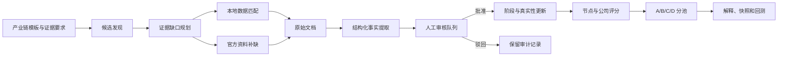

# 产业链证据编排与灵巧手补证设计

> 状态：架构、证据规则和验收口径已经过用户分段确认；书面设计待最终审阅。
>
> 日期：2026-07-12
>
> 依赖设计：`docs/superpowers/specs/2026-07-11-industry-chain-research-selection-v2-design.md`

## 1. 当前缺口

产业链研究与选股模型 V2 已有八层八维、技术路线、传导边、业务映射、四池评分、模型注册和回测接口。2026-07-11 的本地 PostgreSQL UAT 记录了以下状态：

- 灵巧手有 8 个层级节点、64 条横向维度记录、6 条技术路线和 4 条传导边；
- 64 条横向维度全部为 `unknown`，没有可用分数；
- 6 个业务映射对应 5 只股票，全部处于 `E1 / D / watch`；
- 灵巧手映射没有证据事件、阶段跟踪和预期差记录；
- A、B、C 池没有股票，正式快照为 0。

候选生成器保留来源映射 ID，并把派生映射的 `evidence_ids` 置空。该规则阻止原“具身智能”标签证据直接变成“灵巧手受益”证据。现有实现完成了结构和门禁，尚未把本地资料、官方资料、事实提取、人工审核和 V2 评分串成一条灵巧手证据链。

## 2. 本阶段目标

本阶段建设通用证据编排能力，以灵巧手作为首个验收案例。

1. 针对每个业务标签生成证据需求和缺口清单；
2. 先匹配本地数据，只对缺口补查官方资料；
3. 保存原始文档、结构化事实、审核状态和引用位置；
4. 只让批准证据进入真实性、阶段、受益度和四池评分；
5. 独立发现轴向磁通电机候选，不依赖原具身智能映射是否覆盖；
6. 输出候选、证据、缺口、分池原因和下一验证动作；
7. 让后续产业链复用同一编排流程，只替换行业要求和搜索词。

验收不规定 A、B、C 池的最低股票数量。证据不足时，系统应保留 D 池或空池，并说明限制条件。

## 3. 本阶段不做的事

- 不让模型、规则脚本或 LLM 自动批准证据；
- 不把公司整体增长、利润或机器人收入视为灵巧手业务表现；
- 不把研报、媒体和互动问答单独视为订单、收入或客户定点；
- 不降低 E0-E6、A-D 或 AF0-AF6 的门槛来换取非空结果；
- 不新增第二套原始文档、事实或阶段表；
- 不接入实盘交易；
- 不在首轮铺开全部产业链；
- 不以一个评分日宣称模型具有投资有效性。

## 4. 已确认的设计选择

| 项目 | 决策 |
|---|---|
| 数据来源 | 本地数据优先，官方资料补缺 |
| 审核 | 自动提取，人工批准后计分 |
| 复用范围 | 通用能力，灵巧手首验 |
| 输出约束 | 不预设 A、B、C 池数量 |
| 实现路线 | 复用现有采集、事实、审核和评分底座，新增编排层 |
| 历史范围 | 以 `as_of_date` 为终点向前取 3 个完整日历年；产品和专利事实可向前追溯 |
| 日常运行 | 首轮回填后按增量更新，不重复抓取未变化资料 |

## 5. 组件和数据流



### 5.1 证据要求注册器

全局要求保存到 `packages/kronos-factors/configs/industry_chain_evidence_requirements.json`。`industry_chain_templates.json` 继续保存行业覆盖项和技术路线门槛。

通用配置定义以下内容：

- 证据类型及其 E0-E6 等级；
- 允许的事实性质和来源等级；
- 过期天数；
- 每类证据可影响的评分字段；
- 自动搜索词、排除词和组合词；
- 默认的下一验证动作。

行业模板只保存行业差异：业务别名、产品词、客户场景、技术路线、反例和路线门槛。全局要求与行业覆盖项分开，避免每条产业链复制相同规则。

灵巧手空心杯电机的搜索必须同时包含产品词和场景词。单独命中“空心杯电机”只能证明业务线索。能够提升等级的事实需要指向灵巧手、机器人手指、末端执行器、客户验证、定点、订单或交付。

### 5.2 候选发现器

候选发现器包含两条路径。

继承路径读取已有 `business_tag_mapping`，根据业务关键词生成派生候选。系统只保留来源映射 ID，不复制证据等级。

独立路径从公司资料、主营构成、公告、产品页、专利和官方投资者关系资料寻找公司。该路径负责补足原产业链映射没有覆盖的公司。轴向磁通电机必须执行独立发现。

独立路径扫描 `stocks` 中的 A 股公司及其本地资料。一个官方产品、公告或专利文档命中产品词和机器人场景词时，系统可以创建 `candidate / D`；弱来源只能进入发现报告，不能创建正式业务映射。候选发现器不能创建批准事实，也不能提升真实性等级。

### 5.3 证据缺口规划器

规划器对比“业务标签所需事实”和“截止日之前已批准事实”，生成每个映射的缺口状态：

- 已满足；
- 已匹配，待审核；
- 缺失；
- 使用代理值；
- 互相矛盾；
- 已过期。

规划器按来源优先级产生采集任务。若本地年报已经提供产品和收入事实，编排器不再抓取相同网页。官方资料补缺只处理未满足要求。

### 5.4 数据源适配器

本地适配器读取现有公司资料、主营构成、公告索引、互动问答、研究报告、财务和行情表。官方适配器复用数据采集中心已有的交易所公告、公司官网和投资者关系采集能力。

适配器只负责获取文档和元数据。适配器不能生成评分，也不能改变股票池。

来源等级按现有证据目录执行：交易所公告、定期报告和正式订单属于 `strong`；公司官网产品页和官方投资者关系资料属于 `mid`；研报、媒体和互动问答属于 `weak` 或受置信度上限约束的 `mid`。来源等级不改变事实性质，公司目标仍是 `company_claim`，机构预测仍是 `analyst_estimate`。

### 5.5 事实提取器

事实提取器把原文转换为以下结构：

- 公司代码和业务映射；
- 事实类型；
- 事实性质；
- 原文引用；
- 来源等级、发布时间和链接；
- 研究阶段、商业阶段和经营信号；
- 置信度及其上限；
- 适用的产业节点和技术路线。

新事实统一保存为 `pending` 或 `pending_review`。提取器不能把公司目标、机构预测和媒体判断标成 `confirmed_fact`。

### 5.6 审核门禁

审核人需要确认：

- 原文是否支持事实；
- 事实是否指向当前业务标签；
- 发布时间和原始链接是否完整；
- 事实性质和来源等级是否正确；
- 该事实是否改变研究阶段或商业阶段。

审核结果为 `approved`、`rejected` 或 `needs_more_evidence`。现有数据库枚举不含 `needs_more_evidence` 时，编排层把它保存为 `pending_review`，并在审核说明中记录缺口，避免新增一套审核状态。

只有审核动作可以把 `evidence_extracted_facts.validation_status` 改为 `confirmed`，或把 `business_tag_evidence_events.review_status` 改为 `approved`。审核写入必须同时记录审核人、审核时间和说明。自动采集、事实提取和定时任务没有这两个状态的写权限。

### 5.7 评分编排器

评分编排器调用现有 V2 评分器。它只读取截止日之前的确认事实和批准事件，然后依次计算：

```text
业务真实性
→ 商业化阶段
→ 相关业务经营质量
→ 公司受益度
→ 预期差、催化剂和风险
→ A/B/C/D 分池
```

公司整体财务只能作为 `proxy` 经营背景。代理值不提升证据等级，也不能单独推动升池。

预期差、催化剂和风险分开取数。预期差使用批准的业务进展事实、`business_tag_expectation_monitor` 中的机构或公司声明，以及截止日前的市场价格反应。催化剂需要有来源和日期的未来事件；没有事件时保存 `NULL`。风险读取批准的负面事实、证据冲突、技术路线失败条件和可验证的市场风险数据；缺失项同样保存 `NULL`。市场价格和估值只能修正机会分，不能证明产品、客户、订单或收入。

## 6. 数据表复用

本阶段不创建平行证据表。

| 职责 | 现有表 |
|---|---|
| 公司与业务标签 | `business_tag_mapping` |
| 每个映射的证据覆盖和缺口 | `business_tag_l8_evidence_status` |
| 采集任务和错误 | `evidence_collection_jobs` |
| 原始文档 | `raw_evidence_documents` |
| 结构化事实 | `evidence_extracted_facts` |
| 人工审核事件 | `business_tag_evidence_events` |
| 阶段和迁移历史 | `business_tag_stage_tracking`、`business_tag_stage_transition_log` |
| 新鲜度 | `business_tag_evidence_freshness` |
| 预期兑现 | `business_tag_expectation_monitor` |
| 八层八维 | `supply_chain_node_dimensions`、`supply_chain_node_scores` |
| V2 选股分数和池状态 | `business_tag_*_scores`、`business_tag_pool_state`、`business_tag_pool_transition_log` |

`business_tag_l8_evidence_status.dimension_id` 使用稳定的证据要求 ID。`evidence_collection_jobs.scope_payload` 记录链、映射、截止日、来源和运行模式。编排器根据配置与状态表计算下一动作，不把运行时缺口写入新的主表。

## 7. E0-E6 证据等级

| 等级 | 含义 | 允许证据 | 最高池 |
|---|---|---|---|
| E0 | 无法定位来源的传言 | 市场传言、无原文转述 | 排除 |
| E1 | 存在业务线索 | 公司标签、宽泛产品描述 | D |
| E2 | 有相关产品或样机 | 产品规格、机器人样机、原型交付 | C |
| E3 | 有客户验证 | 送样、测试、联合开发、定点 | B |
| E4 | 有订单或交付 | 正式订单、中标、小批量交付 | A 候选 |
| E5 | 有可识别收入 | 公告或定期报告披露的相关收入 | A 候选 |
| E6 | 有可识别利润 | 相关业务毛利或利润贡献 | A 候选 |

E4-E6 需要官方公告、定期报告、正式订单或同等级来源。研报、媒体和互动问答可以支持检索和交叉验证，不能单独提升到 E4。

## 8. 审核与新鲜度

### 8.1 升级

- D 到 C：出现批准的产品或样机事实；
- C 到 B：出现批准的客户送样、验证或定点事实；
- B 到 A 候选：出现批准的订单、交付或收入事实；
- A 候选进入 A：继续满足真实性、商业阶段、受益度、经营覆盖率和风险门槛。

升池需要新批准证据。股价上涨、关键词数量或公司整体业绩不能触发升池。

### 8.2 降级

编排器可因证据过期重新计算并降低最高池。订单取消、交付延期、公司澄清和技术路线失效需要先形成批准的负面事实。每次池变化写入迁移日志，保留触发证据和原因。

### 8.3 有效期

| 证据 | 有效期 |
|---|---:|
| 互动问答 | 90 天 |
| 客户送样、测试 | 180 天 |
| 定点 | 365 天 |
| 已披露收入 | 180 天后重新核验 |

过期证据保留原文和历史状态。评分器把它排除或降低权重，并输出 `stale_reason`。

## 9. 缺失、代理和冲突

| 状态 | 处理 |
|---|---|
| 数据缺失 | 保存 `NULL / unknown` |
| 公司整体财务 | 标记 `proxy`，不能提高业务真实性等级 |
| 没有发布时间 | 不进入正式评分 |
| 事实互相冲突 | 标记 `contradicted`，暂停正向晋级 |
| 只有“可用于机器人” | 最高 E1 / D |
| 有产品但安装位置不明 | 最高 E2 / C |
| 官方网页失败 | 记录任务错误，保留旧数据和缺口 |
| 重复文档 | 按内容哈希去重 |
| 重复事实 | 按映射、事实类型、原文引用和发布日期生成稳定 ID |

## 10. 轴向磁通双门槛

轴向磁通候选同时接受 E0-E6 和 AF0-AF6 约束。最终最高池取两套门槛中较低的一档。

| AF 阶段 | 要求 | 路线最高池 |
|---|---|---|
| AF0 | 只有技术概念 | 不入池 |
| AF1 | 专利或实验室样机 | D |
| AF2 | 机器人规格产品和参数 | C |
| AF3 | 装入关节、腕部或灵巧手样机 | C |
| AF4 | 机器人客户送样、定点或联合验证 | B |
| AF5 | 小批量交付 | A 候选 |
| AF6 | 可识别订单和收入 | A 候选 |

汽车轴向磁通产品对应 AF0 或 AF1，除非公司提供机器人规格和安装证据。系统不得用汽车收入计算灵巧手收入暴露度。

## 11. 运行契约

通用编排入口必须接受：

- `chain_id`；
- `as_of_date`；
- `mode`；
- `source_policy`；
- 可选的 `mapping_id` 或公司代码；
- 每个来源的数量限制。

运行模式：

| 模式 | 数据库行为 |
|---|---|
| `dry-run` | 预览候选、缺口、来源和预计写入；事务回滚 |
| `collect` | 写原始文档、待审核事实和采集任务；不改变股票池 |
| `score` | 只读取批准证据，重算分数和池状态 |
| `full` | 依次执行缺口规划、采集和待审核事实生成；评分需显式允许，且仍只读取批准证据 |

返回结果至少包含：候选数、需求数、本地命中数、官方补缺数、新文档数、重复文档数、待审核事实数、批准事实数、失败数、各池数量和限制说明。

## 12. 时间边界、幂等和错误处理

编排器固定 `as_of_date 23:59:59.999999 Asia/Shanghai` 为证据截止时间。历史评分不能读取此时间之后发布的资料。

公告、年报、调研和互动问答的默认采集窗口为 `[as_of_date - 3 个日历年, as_of_date]`。产品规格和专利可以早于窗口起点，但编排器需要检查产品是否仍在售、专利是否有效，以及后续资料是否推翻旧事实。

同一链、映射、截止日和来源重复运行时：

- 内容哈希阻止重复原始文档；
- 稳定事实 ID 阻止重复事实；
- 同日分数执行 upsert；
- 池变化只在新池与旧池不同时写迁移日志；
- `dry-run` 不留业务数据。

单个来源失败时，任务状态记为 `partial_success`。编排器继续处理其他公司，不删除旧文档、旧事实或旧分数。错误信息不得包含密钥、Cookie 或完整认证头。

## 13. 首轮灵巧手交付

首轮处理以下现有候选：

- 兆威机电；
- 汉威科技；
- 江苏雷利；
- 柯力传感；
- 鸣志电器。

编排器还要执行轴向磁通独立候选发现。结果可以为空，但报告需要列出搜索范围、命中公司、排除原因和 AF 阶段。

交付报告包含：

1. 每只股票的批准证据、待审核事实、驳回记录和缺口；
2. 八层八维的 `known / proxy / unknown / contradicted` 覆盖情况；
3. 四池结果、分数缺失原因、限制门槛和下一验证动作；
4. 轴向磁通候选及双门槛结果；
5. 运行截止日、来源清单、失败来源和数据限制。

首轮优先接通公司证据链。八层八维只更新有来源支持的字段，其余字段保留 `unknown` 并进入缺口报告。

首轮输出 JSON 和 Markdown 报告，并通过现有公司解释 API 返回证据链。本阶段不新增前端页面。

## 14. 验收标准

| 验收项 | 通过条件 |
|---|---|
| 候选覆盖 | 现有 5 只全部处理，并执行轴向磁通独立发现 |
| 可追溯性 | 每条采用事实都有来源、日期、原文和业务标签 |
| 审核安全 | 自动提取事实默认待审核，没有自动批准 |
| 业务隔离 | 公司整体财务不冒充灵巧手业务财务 |
| 缺失语义 | 缺失保存 `NULL / unknown` |
| 防误晋级 | 泛机器人、汽车轴向磁通和泛电机业务不能进入高池 |
| 幂等 | 同一截止日重跑不增加重复文档、事实和迁移记录 |
| 无前视 | 历史评分不读取截止日后的资料 |
| 异常保护 | 单个来源失败不清空旧数据，也不阻断其他候选 |
| 输出诚实 | A、B、C 池可为空，报告说明限制门槛 |

## 15. 测试要求

实现采用测试先行，至少覆盖：

- 业务标签组合词和排除词；
- 来源映射证据不自动继承；
- 官方产品页与泛机器人表述的区别；
- E0-E6 升级和过期降级；
- AF0-AF6 双门槛；
- 截止日和发布时间缺失；
- 文档与事实去重；
- 网络失败、空结果和矛盾事实；
- 未审核事实不参与评分；
- 本地 PostgreSQL 中 5 只股票的端到端试跑。

技术验收完成后，模型继续保持 `staging`。投资有效性验收需要至少 20 个独立评分日和 100 条真实复权收益观测。

## 16. 实施顺序

1. 增加通用证据要求配置和行业覆盖项；
2. 实现候选发现与缺口规划；
3. 接入本地适配器和官方补缺；
4. 接通事实提取与审核队列；
5. 接通 V2 评分和解释输出；
6. 对灵巧手执行 dry-run、采集、审核后评分和 PostgreSQL UAT；
7. 连续生成评分快照，达到样本门槛后回测。

## 17. 发布限制

首轮结果只供研究使用。以下条件全部满足后，团队才能评估是否把模型从 `staging` 升级：

- 用户完成证据审核；
- A、B、C 候选拥有可追溯的批准证据；
- 样本外回测达到既定观测门槛；
- 代码审查、SIT 和正式 UAT 完成；
- 回测结果支持收益、风险和稳定性结论。
