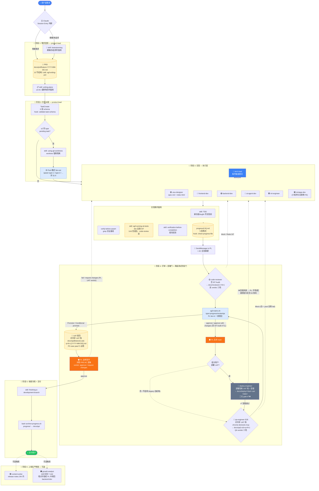
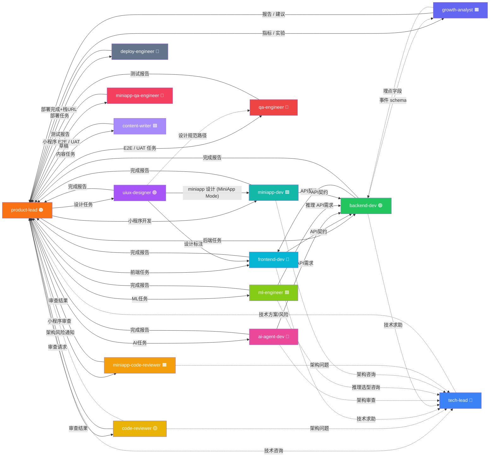

# AppGenesisForge — 角色能力图谱

## 1. 端到端管道总览（全景）

> 本节把**角色 + 阶段门 + hook 触发点 + skill 强制调用 + 失败回路 + Pool fan-out / fan-in + 小程序分支 + 上线后链路**叠加在一张图上。子节速查：§1.1 主流程图 / §1.2 Hook 触发表 / §1.3 Skill 强制调用 / §1.4 小程序变体 / §1.5 失败回路 / **§1.6 Multi-instance Worker Pool 速查** / §1.7 Scrum 词汇映射。其他章节为局部视角：§2 角色消息流、§3 通信关系网络、§4-§7 角色能力详情。**只看一张图就理解整个团队 → §1.1 + §1.6**。

### 1.1 主流程图（用户提需求 → UAT 签字 → 可选上线后产物）

**视觉约定**：

- 圆角胶囊 `([...])` = 起点/终点；矩形 `[...]` = 阶段动作；圆柱 `[(...)]` = 持久工件；菱形 `{...}` = 决策点 / 阶段门
- 实线 = happy path；虚线 = 失败回路 / 可选触发；`subgraph` 框 = 阶段分组（S1..S6）；橙色高亮 = product-lead 关键签字点
- **Pool 模式触发** = S2 检测到同 type ≥ 2 个 pending task 时，S3 / S4 阶段门内的角色被 fan-out 为 `<type>-<N>` 多实例并行，PL 用 `agf-matrix.sh` 做 fan-in 决策（详 §1.6 Pool 速查）

### 1.2 阶段 × Hook 触发点

| 触发时机 | Hook | 行为 | 阻断/告警 |
|---|---|---|---|
| 任何 Bash 调用 | `block-dangerous-bash` | 拦截 `rm -rf` / `DROP TABLE` / `git push --force` / `git reset --hard` | 🛑 硬阻断 |
| 用户 prompt 提交 | `scan-secrets` | 扫 10 厂商密钥 + PEM/SSH/PuTTY/BIP39 | 🛑 硬阻断 |
| WebFetch/WebSearch/Read/Bash/mcp__* 输出 | `sanitize-tool-output` | 检测外部内容里的 prompt-injection 指令 | ⚠️ 软告警 |
| `git commit`（pre-commit） | `scan-commit` → `lint-all.sh --pre-commit` | 对 staged diff 跑同套 secret 正则 + bash/JSON/YAML lint | 🛑 硬阻断 |
| `PreToolUse(TaskCreate)` | `validate-task-schema` | 6 段 schema 缺段（任务描述/类型/上下文/上游产物/AC/预期产物）；caller != product-lead 且短描述自动豁免（main session 内部追踪不卡） | 🛑 硬阻断（产品派单时） |
| `SubagentStop` / `TeammateIdle`（执行层） | `check-progress-file` | 团队有 active task 时校验 `progress/<role>(-<N>)?.md` 存在 + 含 5 段格式（状态/Skills/SIT 证据/质量门/下一步）；团队全 completed 时放行 | 🛑 硬阻断 |
| `TeammateIdle` | `teammate-keepalive` | task list 还有 pending 时 idle | 🛑 阻止 idle |
| `SubagentStop` / `TeammateIdle`（reviewer） | `validate-review-verdict` | code-reviewer / miniapp-code-reviewer verdict 必从 findings 推（critical>0→block 等），声明≠推导 exit 2 打回；极保守 fail-open | 🛑 硬阻断（reviewer 退出时） |

### 1.3 阶段 × Skill 强制调用

| 阶段 | 谁调 | Skill | 跳过条件 |
|---|---|---|---|
| 接到模糊/多选项需求 | product-lead | `superpowers:brainstorming` | 用户已给明确 PRD / 单点 bugfix |
| 写 PRD | product-lead | `agf-writing-prd` | — |
| 实施计划（≥3 AC / 跨角色） | product-lead | `superpowers:writing-plans` | 单角色 / 单 AC |
| 并行派 ≥2 execution teammate | product-lead | `superpowers:using-git-worktrees` | 单实例派发、纯只读 reviewer 并行 |
| 写 ADR | tech-lead | `agf-writing-adr` | — |
| 接入 LLM SDK | ai-agent-dev / backend-dev / ml-engineer | `agf-wiring-multi-llm-sdk` | — |
| 实现新功能 / bugfix 前 | 执行层 5 个角色 | `superpowers:test-driven-development` | 重构 / 文档 / 配置类任务 |
| 遇 bug / 测试失败 | 执行层 + qa | `superpowers:systematic-debugging` | 新功能正常流程 |
| 报完成前 | 执行层 + qa | `superpowers:verification-before-completion` | 中间汇报（progress 阻塞条目除外） |
| 触发 code-reviewer 前 | product-lead | `superpowers:requesting-code-review` | 文档类任务 |
| 跑 SIT（Unit 完成后、code-review 前） | 5 个执行层 dev（frontend-dev / backend-dev / ai-agent-dev / ml-engineer / miniapp-dev） | `agf-running-sit-tests` | 文档类 / 配置类任务（无集成层覆盖） |
| 部署 UAT（合并 main 后、E2E 前） | deploy-engineer | `agf-deploying-uat` | 无 UAT 部署（用户选 no / 不适用）走 legacy 自起栈 |
| 写 E2E / UAT 报告 | qa-engineer / miniapp-qa-engineer | `agf-writing-qa-report` | — |
| code review 时 audit SIT 证据 | code-reviewer / miniapp-code-reviewer | 按 [`code-reviewer.md` `## SIT Audit` 节](../.claude/agents/code-reviewer.md)（4 项检查 + 3 档 verdict） | — |
| 发现 P0 / P1 缺陷需开 issue | dev（SIT 中发现）/ qa-engineer（E2E/UAT 中发现）/ 任意角色（手工）| `agf-writing-github-issue` | P2 缺陷只记 progress 或测试报告，不开 issue |
| 收审查 / UAT 打回 | product-lead / 执行层 | `superpowers:receiving-code-review` | — |
| UAT 签字 + 归档 progress 后整合 | product-lead | `superpowers:finishing-a-development-branch` | 模板 internal commit |

### 1.4 小程序变体（替换主链路部分角色）

小程序场景下主图 S3-S4 做以下替换，其余不变：

| 主链路角色 | 小程序变体 | 关键差异 | Pool 上限差异 |
|---|---|---|---|
| `uiux-designer`（默认 Web 模式） | `uiux-designer`（**MiniApp Mode**） | 产出 WeUI 规范 + 小程序原型，路径 `docs/design/[feature]-miniapp/` | 同为 1（禁 pool）|
| `frontend-dev`（Pool 5）| `miniapp-dev`（Pool 3）| 默认原生 WXML/WXSS/JS，Taro 仅在 3 类触发场景使用 | 5 → 3（小程序 task 通常单一）|
| `code-reviewer`（Pool 5）| `miniapp-code-reviewer`（Pool 3）| 审 `wx.*` API + 包体积 + 审核红线 + 隐私协议 | 5 → 3（haiku 便宜但场景并发量小）|
| `qa-engineer`（Pool 5）| `miniapp-qa-engineer`（Pool 3）| 体验版二维码（E2E）+ 真机扫码（UAT）；SIT 由 `miniapp-dev` 在 DevTools 模拟器自跑 | 5 → 3（真机调度 + 扫码上传成本）|

`backend-dev` / `ai-agent-dev` / `ml-engineer` / `product-lead` / `tech-lead` / `content-writer` / `growth-analyst` 不变（API 层和上线后产物两端共用）。详 [`.claude/standards/miniapp.md`](../.claude/standards/miniapp.md)。

### 1.5 失败回路汇总（4 套 verdict 词表对应 4 类回路）

> 4 套 verdict 词表互不替代（详 [`workflow.md` §Verdict 词表](../.claude/standards/workflow.md)）：code-review / SIT Audit / QA 报告级 / UAT 业务签字。

| 阶段门 | Verdict（命中即失败）| 失败动作 | 回到哪里 |
|---|---|---|---|
| Code Review（代码维度）| `block` | PL 重派执行层修复（与 SIT redo 一并打包，不另起 phase）| S3 实现 |
| Code Review（SIT Audit 维度）| `❌ Redo SIT` | PL 重派执行层补 SIT 证据 + 重跑 | S3 实现（不进 E2E）|
| QA E2E（QA 报告级）| `❌ Block`（pool 模式：任一实例 ❌ 即整 batch fail）| qa 出报告 → PL 重派执行层 | S3 实现（不进 UAT）|
| QA E2E（QA 报告级）| `⚠️ Conditional promote` | PL 决定补救 / 加 issue 跟进 / 进 UAT | S3 实现 或 S4 UAT（看 PL 决策） |
| UAT 业务签字 | `request changes`（product-lead 自有词表）| PL 重派执行层 | S3 实现 |
| Pool 实例失败（单实例）| 任一 `<role>-<N>` 异常退出 / SIT 缺证据 | PL 决定：① spawn `<role>-<N+1>` 重做 / ② 降级单实例 fallback / ③ abort 整 batch | 取决于决策 |
| Pool ≥ 50% 实例失败 | matrix.sh fan-in 显示半数以上红行 | 默认 abort 整 batch + retro 复盘 | S3 实现 |

任一阶段失败 → **不跳级**，回 S3 重做 → 重走完整后续阶段门。**code-reviewer / qa-engineer 永远不直接修源码**。Pool 模式下 fan-in 由 PL 跑 `bash .claude/scripts/agf-matrix.sh --type=...` 一表看全（详 §1.7）。

### 1.6 Multi-instance Worker Pool 速查（fan-out / fan-in 模型）

> ADR-001 决策：同 type 有 ≥ 2 个 pending task 时，PL 自动 fan-out N 个实例 `<type>-<N>`，并发执行后由 PL 用 matrix 工具 fan-in 决策。详 [`ADR-001`](./adr/001-multi-instance-worker-pool.md) + [`workflow.md` §Multi-instance Worker Pool](../.claude/standards/workflow.md)。

**3 个 Pool 层**（与主流程 §1.1 阶段一一对应）：

| Pool | 触发场景 | 实例命名 | 产物路径 |
|---|---|---|---|
| **Dev Pool**（S2-S3） | PRD 拆出 ≥ 2 个同 type dev task（如 3 个 FE 组件） | `frontend-dev-<N>` / `backend-dev-<N>` / `ai-agent-dev-<N>` / `ml-engineer-<N>` / `miniapp-dev-<N>` | `progress/<role>-<N>.md`（5 段格式不变）|
| **Review Pool**（S3-S4 衔接） | ≥ 2 个 dev task 完成排队 review | `code-reviewer-<N>` / `miniapp-code-reviewer-<N>` | `docs/reviews/<feat>-r<N>-<date>.md`（含 YAML frontmatter）|
| **QA Pool**（S4） | ≥ 2 个 task 通过 review 排队 E2E/UAT | `qa-engineer-<N>` / `miniapp-qa-engineer-<N>` | `docs/qa/<feat>-{e2e,uat}-q<N>-<date>.md`（含 YAML frontmatter）|

**Pool 上限**：各角色上限（1 / 3 / 5）+ 按 [`cost-budget.md`](../.claude/standards/cost-budget.md) 的 Small=3 / Med=5 / Large=7 分档，以 [`team-roles.md`](../.claude/standards/team-roles.md) `Pool 上限` 列为权威。

**PL Fan-in 工具**（一表看全，不必逐个开报告）：

| 命令 | 看什么 |
|---|---|
| `bash .claude/scripts/agf-matrix.sh --type=progress` | 全 progress 文件 5 段状态汇总（dev fan-in）|
| `bash .claude/scripts/agf-matrix.sh --type=review --feature=<slug>` | 全 review 报告 verdict + SIT Audit + 计数（review fan-in）|
| `bash .claude/scripts/agf-matrix.sh --type=qa --feature=<slug>` | 全 E2E/UAT 报告 verdict + UAT 签字 + P0 pass^2（qa fan-in）|
| `bash .claude/scripts/archive-progress.sh <feature>` | UAT 通过后归档：按 base role 分组 + 组内按 N 升序合并 `progress/<role>{-<N>}.md` → `docs/qa/<feature>-process-log.md` |

**单实例例外（pool=off）/ 端口偏移 / N 分配算法**：规则细则见 [`ADR-001`](./adr/001-multi-instance-worker-pool.md) + [`workflow.md` §Multi-instance Worker Pool](../.claude/standards/workflow.md)（命中同文件改动 / DB schema / Auth / LLM 切换 / cross-cutting 即走单实例）。

### 1.7 Scrum 词汇 ↔ 本项目载体（feature 流变体）

> Scrum 概念 ↔ 本项目载体的完整映射（Sprint = feature 流 / Product Backlog = `docs/prd/` / Sprint Backlog = `~/.claude/tasks/` / Standup = `progress/` + SendMessage / DoD = [`ac-lifecycle.md`](../.claude/standards/ac-lifecycle.md) / Retro = `/agf-release-retro` 等）与替代理由，见 [`docs/product-workflow.md §4.4`](./product-workflow.md#44-agile--scrum-心法采用清单--词汇替代)（权威唯一源，本节不重复）。

> 注：本表对应 Scrum 词汇但不重写 Scrum——**模板默认不采用 Scrum 全套词汇**，仅保证心法落地。具体项目可在自己的 `docs/glossary.md` 借用 Sprint / Backlog 等术语，不冲突。

---

## 2. 角色协作消息流

```mermaid
flowchart TD
    USER(["👤 用户"])
    PL["🟠 product-lead\nopus · orange\n需求 / 分配 / 验收"]
    TL["🔵 tech-lead\nopus · blue\n架构 / 技术顾问（条件触发）"]
    UX["🟣 uiux-designer\nsonnet · purple\nWeb + MiniApp 设计 / 交互"]
    FE["🩵 frontend-dev\nsonnet · cyan\nUI 组件 / 页面"]
    BE["🟢 backend-dev\nsonnet · green\nAPI / 数据库"]
    AI["🩷 ai-agent-dev\nopus · pink\nLLM / RAG / Agent"]
    CR["🟡 code-reviewer\nsonnet · yellow\n代码质量 / 安全"]
    QA["🔴 qa-engineer\nsonnet · red\nE2E / UAT 执行 + 报告"]
    DE["🩶 deploy-engineer\nsonnet · slate\nUAT 部署 / 容器编排 / 冒烟自检"]
    ML["🟩 ml-engineer\nsonnet · lime\n多模态 / 推理服务 / 文生图·文生视频"]
    MD["🟦 miniapp-dev\nsonnet · teal\n小程序开发 / 原生 / Taro"]
    MCR["🟧 miniapp-code-reviewer\nhaiku · amber\n小程序审查 / 审核合规"]
    MQA["🌷 miniapp-qa-engineer\nsonnet · rose\n小程序 E2E / UAT"]
    CW["🟪 content-writer\nsonnet · violet\nrelease notes / blog / 案例"]
    GA["🟫 growth-analyst\nsonnet · indigo\n指标 / A/B 实验 / 漏斗"]

    USER -->|"用户需求"| PL
    PL -.->|"技术可行性咨询"| TL
    TL -.->|"方案 / 风险 / 工作量"| PL
    PL -->|"设计任务 + 用户旅程"| UX
    PL -->|"工程任务 + 验收标准"| FE
    PL -->|"工程任务 + 验收标准"| BE
    PL -->|"工程任务 + 验收标准"| AI
    PL -->|"工程任务 + 验收标准"| ML
    ML -->|"推理 API 需求"| BE
    ML -->|"完成报告"| PL
    UX -->|"设计标注"| FE
    FE <-->|"API 契约"| BE
    AI -->|"AI API 需求"| BE
    FE -->|"完成报告"| PL
    BE -->|"完成报告"| PL
    AI -->|"完成报告"| PL
    UX -->|"完成报告"| PL
    PL -->|"审查请求"| CR
    CR -->|"审查结果"| PL
    CR -.->|"架构问题"| TL
    CR -.->|"架构风险通知"| PL
    PL -->|"E2E / UAT 任务"| QA
    QA -->|"测试报告"| PL
    PL -->|"部署任务"| DE
    DE -->|"部署完成+栈URL"| PL
    PL -->|"小程序工程任务"| MD
    PL -->|"小程序审查请求"| MCR
    PL -->|"小程序 E2E / UAT"| MQA
    UX -->|"miniapp 设计交付 (MiniApp Mode)"| MD
    MD -->|"API 契约"| BE
    MD -->|"完成报告"| PL
    MCR -->|"审查结果"| PL
    MCR -.->|"架构问题"| TL
    MD -.->|"架构咨询"| TL
    MQA -->|"测试报告"| PL
    PL -->|"内容任务 (UAT 后)"| CW
    CW -->|"草稿 / release notes"| PL
    PL -->|"指标 / 实验任务"| GA
    GA -->|"实验报告 / 建议"| PL
    GA <-.->|"埋点字段对齐"| BE
    PL -->|"交付结果"| USER

    style PL fill:#f97316,color:#fff
    style TL fill:#3b82f6,color:#fff
    style UX fill:#a855f7,color:#fff
    style FE fill:#06b6d4,color:#fff
    style BE fill:#22c55e,color:#fff
    style AI fill:#ec4899,color:#fff
    style CR fill:#eab308,color:#fff
    style QA fill:#ef4444,color:#fff
    style DE fill:#64748b,color:#fff
    style ML fill:#84cc16,color:#fff
    style MD fill:#14b8a6,color:#fff
    style MCR fill:#f59e0b,color:#fff
    style MQA fill:#f43f5e,color:#fff
    style CW fill:#a78bfa,color:#fff
    style GA fill:#6366f1,color:#fff
```

> 下图是**单实例**视角的消息流主链路。**Pool 模式**下被 PL fan-out 的角色（dev / reviewer / qa）以 `<type>-<N>` 多实例并发，但消息箭头方向不变（依然汇聚到 PL）；详 §1.6。

---

## 3. 通信关系网络

> 实线 = 主链路（直派 / 完成报告）；虚线 = 按需咨询。Pool 模式下 `frontend-dev-1` / `frontend-dev-2` 之间**不直接通信**——跨实例协调一律经 PL 中转（详 §1.6）。

---

> 本文档帮助理解团队角色分工、协作关系和模板声明的能力边界；实际运行时可用的 permission mode、tools、skills 与外部能力，以 `.claude/standards/team-roles.md`、各 agent frontmatter 和当前运行环境为准。

## 4. 角色能力对比

| 能力维度 | product-lead | tech-lead | uiux-designer | frontend-dev | backend-dev | ai-agent-dev | code-reviewer | qa-engineer | ml-engineer |
|---|:---:|:---:|:---:|:---:|:---:|:---:|:---:|:---:|:---:|
| **Model** | opus | opus | sonnet | sonnet | sonnet | opus | sonnet | sonnet | sonnet |
| **Color** | 🟠 orange | 🔵 blue | 🟣 purple | 🩵 cyan | 🟢 green | 🩷 pink | 🟡 yellow | 🔴 red | 🟩 lime |
| **Permission** | acceptEdits | acceptEdits | acceptEdits | acceptEdits | acceptEdits | acceptEdits | auto（review-only，Write 仅限 docs/reviews/） | acceptEdits | acceptEdits |
| **Pool 上限**（详 §1.6 + [ADR-001](./adr/001-multi-instance-worker-pool.md)）| **1** 禁 | **1** 禁 | **1** 禁 | **5**（3/5/7）| **5**（3/5/7）| **3** | **5**（3/5/7）| **5**（3/5/7）| **3** |
| **可写文件** | ✅ | ✅ | ✅ | ✅ | ✅ | ✅ | ✅（仅 docs/reviews/） | ✅ | ✅ |
| **WebSearch** | ✅ | ✅ | ❌ | ❌ | ❌ | ✅ | ❌ | ❌ | ✅ |
| **WebFetch** | ✅ | ✅ | ✅ | ✅ | ❌ | ✅ | ❌ | ❌ | ✅ |
| **TaskCreate** | ✅ | ❌ | ❌ | ❌ | ❌ | ✅ | ❌ | ❌ | ❌ |
| **TeamCreate** | ❌ | ❌ | ❌ | ❌ | ❌ | ❌ | ❌ | ❌ | ❌ |
| **SendMessage** | ✅ | ✅ | ✅ | ✅ | ✅ | ✅ | ✅ | ✅ | ✅ |

### 交付链路新增角色能力（独立子表）

> code review 通过 + 合并 main 后介入的部署门角色，单实例立隔离 UAT 栈供 qa-engineer 测；不在 dev / reviewer / qa 并发网格内，故单列子表。

| 能力维度 | deploy-engineer |
|---|:---:|
| **Model** | sonnet |
| **Color** | 🩶 slate |
| **Permission** | acceptEdits |
| **Pool 上限**（详 §1.6 + [ADR-001](./adr/001-multi-instance-worker-pool.md)）| **1** 禁（唯一 UAT 环境）|
| **可写文件** | ✅（默认 `docs/deploy/`；不修源码）|
| **WebSearch** | ❌ |
| **WebFetch** | ❌ |
| **TaskCreate** | ❌ |
| **TeamCreate** | ❌ |
| **SendMessage** | ✅ |

### MiniApp 角色能力（独立子表）

> 微信小程序设计由 `uiux-designer` 在 MiniApp Mode 下完成（见 `agents/uiux-designer.md` 末尾节），故不重复列入。下表只列 3 个 miniapp 专项角色。

| 能力维度 | miniapp-dev | miniapp-code-reviewer | miniapp-qa-engineer |
|---|:---:|:---:|:---:|
| **Model** | sonnet | haiku（cost-budget.md 路由）| sonnet |
| **Color** | 🟦 teal | 🟧 amber | 🌷 rose |
| **Permission** | acceptEdits | auto（review-only，Write 仅限 docs/reviews/） | acceptEdits |
| **Pool 上限**（详 §1.6 + [ADR-001](./adr/001-multi-instance-worker-pool.md)）| **3** | **3** | **3** |
| **可写文件** | ✅ | ✅（仅 docs/reviews/） | ✅ |
| **WebSearch** | ❌ | ❌ | ❌ |
| **WebFetch** | ✅ | ❌ | ❌ |
| **TaskCreate** | ❌ | ❌ | ❌ |
| **TeamCreate** | ❌ | ❌ | ❌ |
| **SendMessage** | ✅ | ✅ | ✅ |

### Post-Launch 角色能力（独立子表）

> Feature 上线后才介入的两位：内容产出与数据分析，不直接参与代码交付链路。

| 能力维度 | content-writer | growth-analyst |
|---|:---:|:---:|
| **Model** | sonnet | sonnet |
| **Color** | 🟪 violet | 🟫 indigo |
| **Permission** | acceptEdits | acceptEdits |
| **可写文件** | ✅（默认 `docs/content/`） | ✅（默认 `docs/growth/`） |
| **WebSearch** | ✅ | ✅ |
| **WebFetch** | ✅ | ✅ |
| **TaskCreate** | ❌ | ❌ |
| **TeamCreate** | ❌ | ❌ |
| **SendMessage** | ✅ | ✅ |

---

## 5. 能力来源说明

| 类别 | 是否属于团队基线 | 权威来源 | 说明 |
|---|---|---|---|
| Claude Code 内置工具 | 是 | `.claude/standards/team-roles.md` | 例如 `Read`、`WebFetch`、`WebSearch`、`SendMessage`、`Task*`；各角色能否使用以 `team-roles.md` 和 agent frontmatter 为准 |
| Plugin Skills | 是 | `.claude/standards/team-roles.md` + 各 agent frontmatter | 例如 `frontend-design`、`feature-dev`、`code-review`、`chrome-devtools-mcp`、`superpowers`；是否预加载、归属哪些角色以权威来源为准 |
| 第三方 MCP / 外部集成 | 否 | 当前运行环境 | 不属于团队模板基线。运行环境已连接 Figma、MiniMax 等外部能力时，可按当前 session 实际可用工具使用，但不视为模板固有能力 |

---

## 6. Plugin Skills 归属

| Plugin | 调用方式 | 归属角色 | 使用场景 |
|---|---|---|---|
| frontend-design | `/frontend-design:*` | uiux-designer, frontend-dev | 组件设计规范、可访问性建议（uiux-designer 同时支持 MiniApp Mode） |
| feature-dev | `/feature-dev:feature-dev` | frontend-dev, backend-dev, ai-agent-dev, miniapp-dev | 快速搭建功能骨架 |
| code-review | `/code-review:*` | code-reviewer, miniapp-code-reviewer | 结构化审查框架 |
| code-simplifier | `/code-simplifier:*` | code-reviewer, backend-dev, miniapp-code-reviewer | 复杂度评估、简洁性建议 |
| chrome-devtools-mcp | `/chrome-devtools-mcp:*` | qa-engineer | E2E 浏览器测试（需连接） |
| superpowers | `/superpowers:*` | product-lead, tech-lead, frontend-dev, backend-dev, ai-agent-dev, qa-engineer, ml-engineer, miniapp-dev, miniapp-qa-engineer, content-writer, growth-analyst | 需求澄清、实现前检查、系统化调试、完成前验证、审查闭环 |

### 项目自有 Skills 归属

> 路径：`.claude/skills/<name>/SKILL.md`；通过 agent frontmatter `skills:` 在角色启动时预加载。

| Skill | 归属角色 | 使用场景 |
|---|---|---|
| agf-wiring-multi-llm-sdk | ai-agent-dev, backend-dev, ml-engineer | DeepSeek/Doubao/Qwen/MiniMax 多厂商接入、OpenAI 兼容适配、fallback 与成本守护 |
| agf-running-sit-tests | frontend-dev, backend-dev, ai-agent-dev, ml-engineer, miniapp-dev（5 dev 自跑 SIT）；reviewer 角色 audit 时参考 | SIT 范围、环境准备、AC 驱动的集成 walk、证据落 `progress/<role>.md` |
| agf-deploying-uat | deploy-engineer | merge 后部署隔离 UAT 栈：适用门 / 隔离起栈（project+端口偏移）/ 迁移 / 冒烟 / 交接 / 部署报告骨架 |
| agf-writing-qa-report | qa-engineer, miniapp-qa-engineer | 写 E2E / UAT 报告时的骨架 + 证据质量条 + verdict 标准（SIT 不在覆盖范围） |
| agf-writing-prd | product-lead | PRD 10-section 结构 + AC 质量条 + 完成前自检 |
| agf-writing-adr | tech-lead | ADR 结构 + 强制备选 + 版本查证 |
| agf-running-release-retro | product-lead | MAJOR / MINOR 释出后的发布复盘（PATCH 跳过） |
| agf-writing-docx-reports | content-writer, product-lead, tech-lead（按需触发） | 程序化生成中文 docx 高密度报告（决议书 / 评审 / 投标书等）；依赖第三方 skill `docx` |
| agf-writing-pptx-reports | content-writer, product-lead, tech-lead（按需触发） | 程序化生成中文 pptx deck（制度 / 党政 / 培训宣贯）；依赖第三方 skill `pptx` |
| agf-writing-github-issue | 全角色按需 + dev SIT 自动 path / qa E2E-UAT 自动 path | 在仓库提 issue（最小输入模式 + 标签锁定）；两条自动 path：① dev 跑 SIT 中发现 P0/P1 → 直接 `gh issue create --label "phase:sit"` ② qa-engineer/miniapp-qa-engineer 在 E2E/UAT 中发现 P0/P1 → 直接 `gh issue create --label "phase:e2e\|phase:uat"`；P2 缺陷不开 issue |

> 上表是项目自有 agf-* skill；另有第三方 `docx` / `pptx`（供 writing-docx/pptx-reports 依赖调用）。skill 清单以 `.claude/skills/` 实际目录为准。外部集成（第三方 MCP）不视为基线，详 §5 表末行。

---

## 7. 核心职责速查

> **"主要输出"列是标签视图，仅供速览**。每个角色完整的产出契约（path / template / must）唯一来源是各 agent 文件的 `## Output Conventions` 节——`product-lead` 派单时填的"预期产物"字段必须对照该节，hook `validate-task-schema.sh` 强制 6 段 schema。

| 角色 | 三个关键词 | 主要输出 |
|---|---|---|
| **product-lead** | 需求挖掘 · 流程编排 · 验收交付 | PRD、任务单、交付报告 |
| **tech-lead** | 架构基线 · 技术选型 · 架构风险评审（条件触发） | 技术方案、ADR、风险预警 |
| **uiux-designer** | Web + MiniApp 设计 · 交互流程 · 静态 HTML 原型 | Web 设计规范 + 原型；MiniApp Mode 下产出 WeUI 规范 + 小程序原型 |
| **frontend-dev** | UI 组件 · 页面实现 · API 对接 | React/Vue 组件、页面、状态管理；Unit + SIT 自跑（`frontend/tests/sit/*`，证据进 `progress/frontend-dev.md` 或 pool 模式 `progress/frontend-dev-<N>.md`，详 §1.6） |
| **backend-dev** | REST API · 数据库 · 业务逻辑 | API 端点、数据库迁移、中间件；Unit + SIT 自跑（`backend/tests/sit/*`，证据进 `progress/backend-dev{-<N>}.md`） |
| **ai-agent-dev** | LLM 集成 · Prompt 工程 · RAG | Agent 工作流、Prompt、RAG 管道；Unit + SIT 自跑（含 prompt + RAG 集成层证据进 `progress/ai-agent-dev{-<N>}.md`） |
| **code-reviewer** | 代码质量 · 安全审计 · SIT Audit | 审查报告含 YAML frontmatter（[`_TEMPLATE.md`](./reviews/_TEMPLATE.md)）+ critical/warning/suggestion + `## SIT Audit` 节（✅ Pass / ⚠️ Pass with concerns / ❌ Redo SIT）；路径 `docs/reviews/<feat>-<date>.md` 或 pool `docs/reviews/<feat>-r<N>-<date>.md` |
| **qa-engineer** | E2E + UAT 执行 · 质量保障 · P0 pass^2 | E2E/UAT 报告含 YAML frontmatter（[`_TEMPLATE.md`](./qa/_TEMPLATE.md)）+ `report_verdict`（Promote/Block/Conditional promote）+ UAT 业务签字 verdict；**P0 case 必须连续跑 2 次都过**（`p0_pass2_total` / `p0_pass2_ok`）；路径 `docs/qa/<feat>-{e2e,uat}-<date>.md` 或 pool `docs/qa/<feat>-{e2e,uat}-q<N>-<date>.md` |
| **deploy-engineer** | UAT 部署 · 容器编排 · 冒烟自检 | UAT 部署报告 `docs/deploy/<feature>-uat-<date>.md`（栈 URL + 冒烟证据 + 二元 gate ✅/❌）；部署源 = 合并后 main，隔离起栈（独立 compose project + 端口偏移），不修源码 |
| **ml-engineer** | 模型集成 · 推理服务 · 多模态 Pipeline | 推理 API 封装、文生图/文生视频管道、模型评估报告；Unit + SIT 自跑（推理链路集成证据进 `progress/ml-engineer{-<N>}.md`） |
| **miniapp-dev** | 小程序开发 · 原生 · Taro 兜底 | 微信小程序页面/组件、wx.* API 集成、组件单测；Unit + SIT 自跑（DevTools 模拟器 + 集成证据进 `progress/miniapp-dev{-<N>}.md`） |
| **miniapp-code-reviewer** | 代码审查 · 审核合规 · 包体积 · SIT Audit | 审查报告（critical/important/minor）+ 审核红线检查表 + `## SIT Audit` 节；路径 `docs/reviews/<feat>-miniapp-<date>.md` 或 pool `-miniapp-r<N>-` |
| **miniapp-qa-engineer** | 真机 E2E / UAT · 审核前置检查 · P0 pass^2 | E2E / UAT 测试报告、审核合规结论（SIT 由 miniapp-dev 自跑、reviewer audit）；路径 `docs/qa/<feat>-miniapp-{e2e,uat}-<date>.md` 或 pool 加 `q<N>` 后缀 |
| **content-writer** | release notes · blog · 用户案例 | `docs/content/release-notes/*` + `docs/content/blog/*` + 案例研究 |
| **growth-analyst** | 北极星指标 · A/B 实验 · 漏斗分析 | `docs/growth/experiments/*`（实验设计 + 报告）+ 指标定义 |
